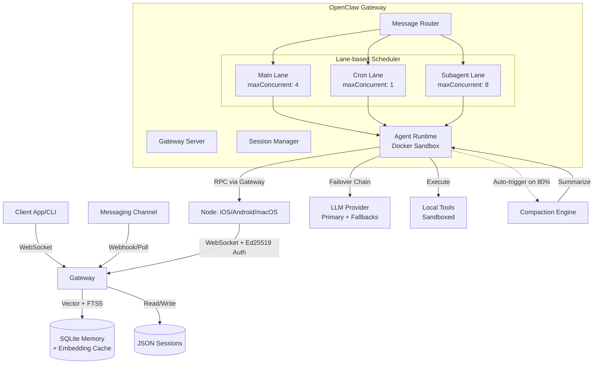
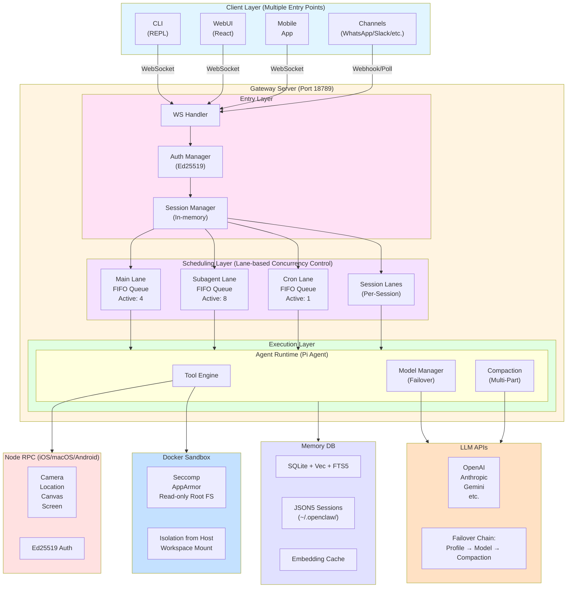

# System Architecture Overview (OpenClaw)

## 概述

OpenClaw 是一个模块化的 AI Gateway，连接消息平台（Channels）与 AI Agents。它作为中央控制平面，管理会话、路由消息并执行工具调用。本文档提供系统整体架构视图，并交叉引用各专项工程文档。

**核心设计原则**:
- ✅ **模块化** - 清晰的组件边界与职责分离
- ✅ **弹性** - 多层降级与自适应机制
- ✅ **可扩展** - 插件化 Channels、Tools、Skills
- ✅ **安全性** - 三层权限验证 + Sandbox 隔离

**关键指标**:
- **支持的并发会话**: 50+ (取决于 Lane 配置)
- **上下文窗口利用率**: ~80% (自动压缩触发)
- **模型切换延迟**: \<500ms (Auth Profile Rotation)
- **工具调用延迟**: \<200ms (本地) / 1-2s (跨设备 RPC)

**版本**: 基于 OpenClaw commit `392bbddf2` (2025-02-05)

---



## System Topology (Detailed)



**Key Connections**:

| Source | Destination | Protocol | Purpose |
|:-------|:-----------|:---------|:--------|
| CLI/WebUI | Gateway | WebSocket (JSON-RPC) | Real-time bidirectional chat |
| Channels | Gateway | HTTP Webhooks / Polling | External messaging integration |
| Nodes (iOS/Android) | Gateway | WebSocket + Ed25519 | Device RPC for camera/location/canvas |
| Agent | LLM APIs | HTTPS (OpenAI/Anthropic format) | Model inference with failover |
| Agent | Memory DB | SQLite file I/O | Vector search + session persistence |
| Agent | Docker Sandbox | Docker exec API | Tool execution in isolated environment |

## Core Components

### 1. Gateway Server (`src/gateway/`)
The heart of the system. It exposes a WebSocket interface for clients (CLI, UI, Mobile) and manages the lifecycle of the application.
- **Protocol**: Custom JSON-based WebSocket protocol.
- **State**: In-memory mapping of active connections and sessions.
- **Discovery**: mDNS/Bonjour for local network discovery.

### 2. Channels (`extensions/`)
Pluggable adapters that connect to external messaging services (WhatsApp, Telegram, Slack, etc.).
- **Inbound**: Receives messages via webhooks or polling.
- **Outbound**: Sends messages via provider APIs.
- **Normalization**: Converts provider-specific events into standard OpenClaw `ChatEvent` objects.

### 3. Agent Runtime (`src/agents/`)
Executes the AI logic ("Pi Agent").
- **Loop**: Observation -> Thought -> Action -> Observation.
- **Context**: Manages conversation history and short-term memory.
- **Tools**: Executes local code (sandboxed) or calls external APIs.

### 4. Data Layer
- **Session Store**: JSON-based storage for chat history and session metadata.
- **Memory**: SQLite-based vector store for long-term memory (RAG).

### Component Interaction Matrix

The table below maps **which components depend on which**, showing data flow direction and API boundaries:

| Component | Depends On | API/Interface | Data Flow Direction |
|:----------|:-----------|:--------------|:-------------------|
| **Gateway Server** | Session Manager, Lane Scheduler | Internal (in-process) | Bidirectional |
| **Gateway Server** | Memory DB | File I/O (SQLite) | Read/Write |
| **Gateway Server** | Node Registry | Internal state | Read/Write |
| **Channels** | Gateway Server | HTTP Webhooks → WebSocket | Inbound (webhook) → Outbound (WS) |
| **CLI/WebUI** | Gateway Server | WebSocket JSON-RPC | Bidirectional |
| **Lane Scheduler** | Agent Runtime | Process spawn/exec | Enqueue → Execute |
| **Agent Runtime** | Tool Engine | Function calls | Direct invocation |
| **Agent Runtime** | LLM APIs | HTTPS (REST) | Request → Response |
| **Agent Runtime** | Memory DB | SQLite queries | Read (RAG search) |
| **Agent Runtime** | Compaction Engine | Function call | Trigger → Compress |
| **Tool Engine** | Node Registry (for RPC) | Gateway proxy | Tool call → Node invoke |
| **Tool Engine** | Docker Sandbox | Docker API | Spawn → Execute → Collect |
| **Compaction Engine** | LLM APIs | HTTPS (summarization) | Send transcript → Receive summary |
| **Node (iOS/Android)** | Gateway Server | WebSocket + Ed25519 | Bidirectional (authenticated) |
| **Memory DB** | Embedding API | HTTPS (vector generation) | Text → Embedding vector |

**Isolation Boundaries**:
- **Network Boundary**: Agent Runtime ↔ LLM APIs (external HTTPS)
- **Process Boundary**: Gateway ↔ Docker Sandbox (container isolation)
- **Authentication Boundary**: Gateway ↔ Nodes (Ed25519 signature verification)

## Data Flow

### Inbound Message
1.  **Channel** receives webhook from Provider (e.g., Twilio/Slack).
2.  **Channel** normalizes payload to `ChatEvent`.
3.  **Gateway** routes event to the correct `Session`.
4.  **Session** appends message to history.
5.  **Agent** is triggered (if active).

### Agent Execution
1.  **Agent** reads session history.
2.  **Agent** sends prompt to LLM.
3.  **LLM** returns response (text or tool call).
4.  **Agent** executes tool (if needed) or sends text response.
5.  **Gateway** routes response back to **Channel**.
6.  **Channel** calls Provider API to deliver message.

### Key Operation Sequences

#### Sequence 1: User Message → Agent Response (Happy Path)

```
[User] → [Channel] → [Gateway] → [Lane Scheduler] → [Agent Runtime] → [LLM API] → [User]

Detailed Steps:
1. User sends "What's the weather in SF?" via WhatsApp
2. Twilio webhook → Channel plugin receives POST request
3. Channel normalizes to ChatEvent { role: 'user', content: '...' }
4. Gateway.handleInboundMessage(event)
   - Lookup sessionId by phone number
   - Append event to session.messages[]
   - Trigger agent run
5. Gateway enqueues task to Main Lane
   - Check: active < maxConcurrent?
   - If yes: dequeue and spawn agent
   - If no: push to FIFO queue
6. Agent Runtime starts
   - Load session history from ~/.openclaw/sessions/{id}.json
   - Check token count: if > 80% → trigger compaction
   - Build prompt with history + system instructions
7. Agent calls LLM API (with failover chain)
   - Primary: anthropic/claude-sonnet-3-5
   - Fallback on 429: rotate auth profile
   - Fallback on persistent error: try fallback model
8. LLM returns tool_call { name: "location.get" }
9. Agent executes tool
   - Check: local tool or Node RPC?
   - For location.get → Node RPC flow (see Sequence 2)
10. LLM returns final response: "It's 68°F and sunny in SF"
11. Gateway broadcasts response to all connected clients
12. Channel receives response, calls Twilio API to send WhatsApp message
13. User receives reply

Total latency: ~2-5 seconds (LLM + network overhead)
```

#### Sequence 2: Agent Calls Node Tool (Cross-Device RPC)

```
[Agent] → [Gateway] → [Node (iPhone)] → [Gateway] → [Agent]

Detailed Steps:
1. Agent decides to call camera.snap tool
2. Agent invokes nodes tool:
   nodes({
     command: "camera.snap",
     args: { quality: "high" },
     platform: "ios"
   })
3. Tool implementation (nodes-tool.ts):
   - Generates idempotencyKey (UUID)
   - Calls Gateway RPC: gateway.node.invoke.request
4. Gateway.handleNodeInvokeRequest:
   - Lookup nodeId from registry (filter by platform=ios)
   - Check node is paired (pairingToken validation)
   - Check command is in allowlist for platform
   - Send node.invoke.request over WebSocket to Node
5. Node (iPhone) receives request:
   - Verify Ed25519 signature
   - Check command in declared capabilities
   - Execute native iOS camera API
   - Capture photo → base64 encode
6. Node sends node.invoke.result back to Gateway
7. Gateway routes result back to Agent (via pending request map)
8. Agent receives photo data, continues execution

Total latency: ~1-3 seconds (includes camera capture time)

Error scenarios:
- Node offline: Gateway returns error immediately
- Command not in allowlist: Rejected at step 4
- Signature invalid: Node rejects at step 5
```

#### Sequence 3: Context Overflow → Auto-Compaction → Retry

```
[Agent] → [LLM API] → [Error] → [Compaction] → [Retry] → [Success]

Detailed Steps:
1. Agent builds prompt with 150 messages (~60K tokens)
2. Send to LLM API (Claude Sonnet, context limit = 200K)
3. LLM returns 400 "context_length_exceeded"
4. Agent catches error, checks: compaction already attempted?
   - If no: trigger compaction
   - If yes: fail over to larger-context model
5. Compaction flow:
   - Load full session history
   - Estimate tokens: 60K
   - Calculate chunk count: 60K / (200K × 0.4) ≈ 1 part (no split needed)
   - But adaptive chunking: average message size > 10% threshold
   - Split into 2 parts
   - Summarize each part in parallel (2 LLM calls)
   - Merge summaries → final compressed history (~8K tokens)
6. Update session with compacted history
7. Retry agent run with compressed history
8. LLM accepts request, returns response
9. Success

Compaction savings: 60K → 8K tokens (87% reduction)
```

---

## Scheduling & Concurrency Control

OpenClaw uses a **Lane-based Queuing System** to manage concurrent agent execution while ensuring resource isolation and message ordering.

### Lane System Architecture

**Implementation**: `src/process/command-queue.ts`, `src/gateway/server-lanes.ts`

The system categorizes tasks into distinct **Lanes**, each with independent concurrency limits:

| Lane | Purpose | Default Concurrency | Configuration Path |
|:-----|:--------|:-------------------|:-------------------|
| **Main** | User-facing chat interactions | Config-adjustable | `agents.defaults.maxConcurrent` |
| **Subagent** | Nested agent tasks spawned by primary agents | Config-adjustable | `agents.defaults.subagent.maxConcurrent` |
| **Cron** | Background scheduled tasks | 1 (serialized) | `cron.maxConcurrentRuns` |
| **Nested** | Recursive agent operations | 1 (hard-coded) | N/A |

**Key Design Principle**: A slow cron job won't block main chat interactions. Each lane operates independently with its own FIFO queue and active task counter.

### Queue Implementation

```typescript
type LaneState = {
  lane: string;              // Lane identifier
  queue: QueueEntry[];       // FIFO queue of pending tasks
  active: number;            // Currently executing tasks
  maxConcurrent: number;     // Concurrency limit
  draining: boolean;         // Drain operation in progress
};
```

**Scheduling Algorithm** (`drainLane`):
```
WHILE (active < maxConcurrent && queue.length > 0):
    - Dequeue next task from head
    - active += 1
    - Execute task asynchronously
    - On completion: active -= 1, pump() to continue draining
```

### Message Ordering & Sequencing

**Challenge**: WebSocket streaming delivers agent responses (deltas, tool calls) asynchronously. How to maintain order?

**Solution** (`agentRunSeq`):
- Every agent run receives a unique `runId` (UUID)
- A global sequence map tracks message order: `Map<runId, seqNumber>`
- Each event increments the sequence counter
- Clients detect gaps and trigger "sequence error" alerts

**Implementation**: `src/gateway/server-runtime-state.ts`

### Task Cancellation

**Mechanism**: `chatAbortControllers` - a map of `runId → AbortController`

**Flow**:
1. User sends `/stop` or `chat.abort` RPC
2. Gateway retrieves `chatAbortControllers.get(runId)`
3. Calls `controller.abort()`
4. Agent receives signal and halts execution
5. Broadcasts `aborted` state to all connected clients

**Granularity**: Per-run cancellation without killing the entire process.

---

## Memory & Context Management

OpenClaw breaks through LLM context window limits using a **Hybrid Memory Architecture** combining session compaction and vector-based retrieval (RAG).

### Two-Tier Memory Model

#### Layer 1: Session History (Short-term)

**Storage**: JSON5 files at `~/.openclaw/sessions/{sessionId}.json`

**Contents**:
- Complete user/assistant conversation
- Tool call records (inputs/outputs)
- Metadata (timestamps, run IDs)

**Token Tracking**: Real-time estimation using `estimateTokens()` (rough heuristic: ~4 chars = 1 token)

#### Layer 2: Vector Memory (Long-term)

**Storage**: SQLite + `sqlite-vec` extension

**Purpose**: Semantic search across indexed codebase, documents, and past conversations

### Compaction System

**Trigger Conditions**:
1. **Context Threshold**: Estimated tokens exceed 80% of model's context window
2. **API Error**: `context_length_exceeded` exception
3. **Manual**: User invokes `/compact` command

**Implementation**: `src/agents/compaction.ts`

**Algorithm - Multi-Stage Summarization**:

```
Original History (N messages, ~50K tokens)
    ↓
Split into P parts based on BASE_CHUNK_RATIO (0.4)
    ↓
Summarize each part in parallel (LLM calls)
    ↓
Merge summaries (recursive if still too large)
    ↓
Final compressed result (~5-10K tokens)
```

**Adaptive Chunking**: If average message size exceeds 10% of context window, the chunk ratio drops toward `MIN_CHUNK_RATIO` (0.15) to ensure more aggressive compression.

**Information Preservation Strategy**:
- ✅ **Keep**: Decisions, TODOs, open questions, constraints
- ❌ **Drop**: Exploration process, redundant clarifications, temporary states

**Fallback**: If full summarization fails, the system attempts to summarize only "small" messages and annotates omitted oversized content.

### Hybrid RAG (Vector + Keyword Search)

**Implementation**: `src/memory/manager.ts`, `src/memory/hybrid.ts`

**Search Architecture**:

```
User Query: "How does authentication work?"
    ↓
[Vector Branch]                      [Keyword Branch]
Generate embedding                   Tokenize query → FTS5
    ↓                                     ↓
sqlite-vec cosine similarity         BM25 ranking
    ↓                                     ↓
Top-K results (scored 0-1)          Top-K results (scored 0-1)
    ↓                                     ↓
            Merge with weighted sum
                    ↓
            Inject into prompt as <context>
```

**Vector Search**:
- Uses `vec_distance_cosine` (cosine similarity)
- Fallback: Brute-force JS calculation if `sqlite-vec` unavailable

**Keyword Search**:
- SQLite FTS5 virtual table (`chunks_fts`)
- Query transformation: `"token1" AND "token2"` (quoted AND-join)
- BM25 scoring converted to 0-1 range via `1 / (1 + max(0, rank))`

**Hybrid Scoring**:
```typescript
finalScore = (vectorWeight × vectorScore) + (textWeight × textScore)
```

### Embedding Cache

**Purpose**: Avoid redundant API calls for identical content

**Storage**: SQLite table `embedding_cache`

**Key**: Composite primary key `(provider, model, provider_key, hash)`

**Strategy**:
- Content hashed before embedding request
- Cache lookup: if hash exists, reuse embedding
- Persistence: Cache survives across sessions
- **Cost Reduction**: 90%+ fewer embedding API calls

**Invalidation**: Automatic when file content changes (hash mismatch)

---

## Tool Invocation Architecture

OpenClaw's tool system bridges sandboxed agent execution with external system access through a **multi-hop WebSocket RPC** design.

### Agent → Gateway → Node Flow

**Scenario**: Agent needs to capture a photo using iPhone camera

```
[Agent Container]                 [Gateway]                    [Node: iPhone]
      |                              |                               |
      | 1. Call nodes tool           |                               |
      |   (command: camera.snap)     |                               |
      |----------------------------->|                               |
      |                              | 2. Lookup nodeId in registry  |
      |                              |                               |
      |                              | 3. node.invoke.request        |
      |                              |   (WebSocket RPC)             |
      |                              |------------------------------>|
      |                              |                               | 4. Execute camera.snap
      |                              |                               |    (native iOS API)
      |                              |                               |
      |                              | 5. node.invoke.result         |
      |                              |<------------------------------|
      | 6. Return result to agent    |                               |
      |<-----------------------------|                               |
```

**Implementation**:
- Agent side: `src/agents/tools/nodes-tool.ts`
- Gateway side: `src/gateway/server-methods/nodes.ts`
- Registry: `src/gateway/node-registry.ts`

### Permission Triple-Check

Every tool invocation undergoes three-layer validation:

#### 1. Authentication (Device Signature)
- **Method**: Ed25519 signature verification
- **Payload**: Device identity + `signedAt` timestamp (replay prevention)
- **Implementation**: `src/infra/device-identity.ts`

#### 2. Authorization (Pairing Token)
- **Mechanism**: Each node must be explicitly paired
- **Flow**: 
  1. New node connects → `device.pair.requested` broadcast
  2. User approves pairing → unique `pairingToken` issued
  3. Token persisted in `paired.json`
- **Enforcement**: Gateway checks `nodeId` against paired registry

#### 3. Command Allowlist
- **Policy**: `src/gateway/node-command-policy.ts`
- **Platform-specific**:
  - **macOS**: `system.run`, `system.which`, `browser.proxy`, `location.get`, `camera.*`
  - **iOS**: `canvas.*`, `camera.*`, `screen.record`, `location.get`
  - **Android**: iOS capabilities + `sms.send`
- **Double-check**: Command must be in platform allowlist AND declared by node in handshake

### Tool Policy Pipeline

OpenClaw 使用多层 Tool Policy 管道来控制 Agent 可用的工具集。

**实现**: `src/agents/tool-policy.ts`

```
┌─────────────────────────────────────────────────────────────┐
│                     Tool Policy Pipeline                     │
├─────────────────────────────────────────────────────────────┤
│                                                              │
│  1. Base Profile (tools.profile)                            │
│     minimal | coding | messaging | full                      │
│     ↓                                                        │
│  2. Provider Override (tools.byProvider)                    │
│     Per-provider/model restrictions                          │
│     ↓                                                        │
│  3. Allow List (tools.allow)                                │
│     Explicit tool/group additions                            │
│     ↓                                                        │
│  4. Deny List (tools.deny)                                  │
│     Explicit tool/group removals (wins over allow)           │
│     ↓                                                        │
│  5. Owner-Only Filter (applyOwnerOnlyToolPolicy)            │
│     Sensitive tools restricted to owner senders              │
│     ↓                                                        │
│  Final Tool Set → Agent                                      │
│                                                              │
└─────────────────────────────────────────────────────────────┘
```

**Tool Profiles**:

| Profile | 允许的工具 |
|:--------|:----------|
| `minimal` | `session_status` only |
| `coding` | `group:fs`, `group:runtime`, `group:sessions`, `group:memory`, `image` |
| `messaging` | `group:messaging`, `sessions_list`, `sessions_history`, `sessions_send`, `session_status` |
| `full` | 无限制 (默认) |

**Tool Groups**:

| Group | 包含的工具 |
|:------|:----------|
| `group:fs` | `read`, `write`, `edit`, `apply_patch` |
| `group:runtime` | `exec`, `process` |
| `group:sessions` | `sessions_list`, `sessions_history`, `sessions_send`, `sessions_spawn`, `session_status` |
| `group:memory` | `memory_search`, `memory_get` |
| `group:web` | `web_search`, `web_fetch` |
| `group:ui` | `browser`, `canvas` |
| `group:automation` | `cron`, `gateway` |
| `group:messaging` | `message` |
| `group:nodes` | `nodes` |

**Owner-Only Tools**:

敏感工具仅限 owner 用户调用，非 owner 用户的工具列表中不会包含这些工具：

```typescript
const OWNER_ONLY_TOOL_NAMES = new Set<string>(["whatsapp_login"]);

export function applyOwnerOnlyToolPolicy(tools: AnyAgentTool[], senderIsOwner: boolean) {
  if (senderIsOwner) return tools;
  return tools.filter((tool) => !isOwnerOnlyToolName(tool.name));
}
```

**配置示例**:

```json5
{
  tools: {
    profile: "coding",
    deny: ["group:runtime"],  // 全局禁用 exec/process
    byProvider: {
      "google-antigravity": { profile: "minimal" },  // 特定 provider 限制
    },
  },
  agents: {
    list: [
      {
        id: "support",
        tools: { profile: "messaging", allow: ["slack"] },  // Agent 级别覆盖
      },
    ],
  },
}
```

**PonyBunny 参考价值**:
- **Skill 权限分级**: 可参考 Tool Profile 设计不同 Skill 的工具访问权限
- **Work Item 工具限制**: 不同类型/优先级的 Work Item 可配置不同的 Tool Profile
- **Escalation 触发**: Owner-Only 模式可用于实现需要人工审批的敏感操作

### Idempotency Protection

**Problem**: Network failures could cause duplicate executions

**Solution**: `idempotencyKey` per request
- Generated by agent before sending
- Stored in `NodeRegistry` pending map
- Duplicate requests with same key return cached result

### Docker Sandbox Isolation

**Configuration**: `src/agents/sandbox/docker.ts`

**Security Measures**:

| Feature | Configuration |
|:--------|:--------------|
| **Root Filesystem** | Read-only (`readOnlyRoot: true`) |
| **Security Profiles** | Seccomp, AppArmor |
| **Capabilities** | Explicit drops via `capDrop` |
| **Privileges** | `no-new-privileges` flag |
| **Resources** | `memory`, `cpus`, `pidsLimit`, `ulimits` |
| **Workspace** | Volume mount with optional `:ro` |

**Isolation Model**: Even if agent is compromised, it cannot:
- Modify host filesystem (read-only root)
- Escalate privileges (capability drops)
- Spawn excessive processes (PID limits)
- Directly access network (must route through Gateway)

---

## Model Selection & Failover

OpenClaw's resilience strategy handles model failures, quota limits, and provider-specific quirks through intelligent failover and adaptation.

### Thinking Level Auto-Downgrade

**Problem**: Strong reasoning models (GPT-4o, Opus) support `thinkingLevel: high`, but weaker models reject this parameter.

**Solution**: Automatic downgrade on error

**Flow**:
```
User config: thinkingLevel = "high"
    ↓
LLM returns 400 "Unsupported parameter"
    ↓
Parse error message for valid values
    ↓
Retry with: high → medium → low → minimal → off
    ↓
Success or abort
```

**Implementation**: `src/agents/pi-embedded-helpers/thinking.ts` (`pickFallbackThinkingLevel`)

### Multi-Tier Failover Chain

#### Tier 1: Auth Profile Rotation

**Trigger**: Rate limit (429), billing error (402), authentication failure

**Strategy**: Rotate to next auth profile for the same provider
- Each profile enters cooldown period on failure
- Prevents cascading quota exhaustion

#### Tier 2: Model Fallback

**Trigger**: Persistent errors, quota exhausted across all profiles

**Configuration**: `agents.defaults.model.fallbacks`

**Example**:
```json
{
  "model": "anthropic/claude-sonnet-3-5",
  "fallbacks": ["anthropic/claude-haiku-3-5", "openai/gpt-3.5-turbo"]
}
```

**Logic**: `src/agents/model-fallback.ts` (`runWithModelFallback`)
- Iterates through fallback chain
- Each model attempted with fresh auth profiles
- Fails only if entire chain exhausted

#### Tier 3: Auto-Compaction Before Failover

**Special Case**: `context_length_exceeded`

**Before** failing over to larger-context model:
1. Attempt session compaction (summarization)
2. Retry with compressed history
3. Only failover if compaction insufficient

**Benefit**: Avoids unnecessary model switch when context can be compressed

### Provider-Specific Adaptations

Different LLM providers have incompatible conversation formats. OpenClaw implements per-provider "turn validators":

#### Gemini Turn Validation
**Requirement**: Strict `user → assistant → tool → user` alternation

**Solution**: `validateGeminiTurns` (`src/agents/pi-embedded-helpers/turns.ts`)
- Merges consecutive assistant messages
- Inserts synthetic user message if transcript starts with assistant

#### Anthropic Turn Validation
**Requirement**: Alternating user/assistant roles

**Solution**: `validateAnthropicTurns`
- Merges consecutive user messages
- Ensures no two user/assistant messages in sequence

#### OpenAI Reasoning Block Patching
**Issue**: Trailing reasoning blocks without content blocks cause API rejection

**Solution**: `downgradeOpenAIReasoningBlocks` (`src/agents/pi-embedded-helpers/openai.ts`)
- Detects orphaned reasoning blocks
- Drops them before API submission

### Weak Model Compensation

**Challenge**: 8B-parameter models (Qwen, Llama) struggle with:
- Multi-step tool calling coherence
- JSON schema compliance
- Path resolution (relative vs absolute)

**Mitigation Strategies**:

1. **Explicit Prompt Engineering**: More detailed step-by-step instructions (vs abstract goal-setting for strong models)
2. **Few-Shot Examples**: Inject tool call examples in system prompt
3. **Runtime Info Injection**: Every turn includes current working directory, completed steps, remaining goals
4. **Workspace Notes**: Use `MEMORY.md` file as external "memory" for weak models to "take notes"
5. **Forced Sandbox**: Weak models MUST run in sandbox (prevent destructive operations from logic errors)

**Cost/Performance Trade-off**:
- Strong model (Sonnet) for main agent: Complex reasoning
- Weak model (Haiku) for subagents: Simple, well-defined tasks
- Reduces cost by 60-80% while maintaining reliability

### Model Capability Detection

**Auto-detection** (recommended implementation):

```typescript
function detectModelCapabilities(modelId: string) {
  const capabilities = {
    reasoning: false,
    vision: false,
    contextWindow: 8192,
  };
  
  if (modelId.includes('gpt-4') || modelId.includes('opus')) {
    capabilities.reasoning = true;
    capabilities.contextWindow = 128000;
  }
  
  if (modelId.includes('vision') || modelId.includes('gpt-4o')) {
    capabilities.vision = true;
  }
  
  return capabilities;
}
```

**Purpose**: Prevent wasted API calls by pre-filtering unsupported features

---

## Design Patterns Catalog

OpenClaw's architecture leverages several foundational design patterns to achieve modularity, resilience, and extensibility.

### 1. Observer Pattern (Event Broadcasting)

**Implementation**: `src/gateway/server-runtime-state.ts` → `broadcastToSession()`

**Purpose**: Notify all connected clients when agent state changes (streaming deltas, tool calls, completion)

**Structure**:
```typescript
// Central event broadcaster
function broadcastToSession(sessionId: string, event: ChatEvent) {
  const connections = sessionConnections.get(sessionId) || [];
  for (const conn of connections) {
    conn.send(JSON.stringify(event));
  }
}

// Multiple subscribers (CLI, WebUI, Mobile app) receive same event
```

**Benefits**:
- ✅ Decouples agent execution from client rendering
- ✅ Supports multiple simultaneous clients per session
- ✅ Real-time streaming without polling

### 2. Strategy Pattern (Model Selection & Auth Providers)

**Implementation**: 
- Model selection: `src/agents/model-fallback.ts`
- Auth providers: `src/config/auth-profiles.ts`

**Purpose**: Swap LLM providers or authentication methods at runtime without changing agent code

**Structure**:
```typescript
interface LLMStrategy {
  provider: string;
  model: string;
  authProfile: string;
  invoke(prompt: string): Promise<Response>;
}

// Runtime selection based on config + failover state
const strategy = selectStrategy(config, failoverState);
const response = await strategy.invoke(prompt);
```

**Benefits**:
- ✅ Easy addition of new LLM providers (just implement interface)
- ✅ Dynamic failover without code changes
- ✅ Testing with mock strategies

### 3. Chain of Responsibility (Failover Chain)

**Implementation**: `src/agents/model-fallback.ts` → `runWithModelFallback()`

**Purpose**: Handle LLM errors through progressive fallback: Auth Profile → Model → Compaction

**Flow**:
```
Request → Primary Model + Profile 1 → (429 error)
       → Primary Model + Profile 2 → (429 error)
       → Primary Model + Profile 3 → (429 error)
       → Fallback Model 1 + Profile 1 → (400 error)
       → Trigger Compaction → Retry Fallback Model 1 → (success)
```

**Benefits**:
- ✅ Automatic recovery from transient failures
- ✅ Quota management across multiple API keys
- ✅ Graceful degradation (Opus → Sonnet → Haiku)

### 4. Factory Pattern (Agent Instantiation)

**Implementation**: `src/agents/pi-embedded-runner/create.ts`

**Purpose**: Create agent instances with platform-specific configurations (sandboxed vs native)

**Structure**:
```typescript
function createAgent(config: AgentConfig): Agent {
  if (config.sandboxMode === 'docker') {
    return new DockerSandboxAgent(config);
  } else if (config.sandboxMode === 'native') {
    return new NativeAgent(config);
  }
  // Default: Docker for security
  return new DockerSandboxAgent(config);
}
```

**Benefits**:
- ✅ Centralized agent creation logic
- ✅ Platform-specific customization (e.g., Docker unavailable on mobile → fallback to native)
- ✅ Easier testing (inject mock agents)

### 5. Singleton Pattern (Config & Registries)

**Implementation**:
- Config: `src/config/load.ts` → `getConfig()`
- Node Registry: `src/gateway/node-registry.ts` → `NodeRegistry` (single instance)

**Purpose**: Ensure single source of truth for global state

**Structure**:
```typescript
let configInstance: Config | null = null;

export function getConfig(): Config {
  if (!configInstance) {
    configInstance = loadConfigFromDisk();
  }
  return configInstance;
}
```

**Benefits**:
- ✅ Avoid config drift (everyone reads same instance)
- ✅ Lazy initialization (load on first access)
- ✅ Easier to mock for testing

### 6. Adapter Pattern (Channel Plugins)

**Implementation**: `extensions/` (WhatsApp, Slack, Telegram channels)

**Purpose**: Normalize different messaging platform APIs into uniform `ChatEvent` interface

**Structure**:
```typescript
interface Channel {
  name: string;
  handleWebhook(req: Request): Promise<ChatEvent>;
  sendMessage(event: ChatEvent): Promise<void>;
}

// Each channel adapts its provider's format
class WhatsAppChannel implements Channel {
  async handleWebhook(req) {
    const twilio = parseTwilioPayload(req.body);
    return { role: 'user', content: twilio.Body, ... };
  }
}
```

**Benefits**:
- ✅ Gateway code agnostic to messaging platforms
- ✅ Easy addition of new channels (implement interface)
- ✅ Testable with mock channels

---

## Performance Profile

### Latency Breakdown (Typical User Query)

| Stage | Latency | Notes |
|:------|:--------|:------|
| **Webhook → Gateway** | 10-50ms | Network + parsing |
| **Gateway → Lane Enqueue** | 1-5ms | In-memory queue operation |
| **Queue Wait Time** | 0-2000ms | Depends on concurrency (0 if lane available) |
| **Agent Startup** | 50-200ms | Docker spawn (cached) or native process |
| **Session Load** | 10-50ms | JSON5 parse from disk |
| **Compaction Check** | 5-10ms | Token estimation |
| **LLM API Call** | 1000-3000ms | **Dominant factor** (network + inference) |
| **Tool Execution (local)** | 10-100ms | Sandboxed command execution |
| **Tool Execution (Node RPC)** | 500-2000ms | Cross-device network latency |
| **Response Broadcast** | 5-20ms | WebSocket fanout to clients |
| **Total (no RPC)** | **1.5-4 seconds** | Typical chat interaction |
| **Total (with RPC)** | **2-6 seconds** | If Node tool called |

### Throughput Limits

| Resource | Limit | Configuration |
|:---------|:------|:--------------|
| **Concurrent Main Lane Tasks** | 4 (default) | `agents.defaults.maxConcurrent` |
| **Concurrent Subagent Tasks** | 8 (default) | `agents.defaults.subagent.maxConcurrent` |
| **WebSocket Connections** | 1000+ | OS-level limits (ulimit) |
| **Sessions (active in memory)** | 100-500 | Depends on context window usage |
| **SQLite Writes/sec** | 1000-5000 | WAL mode, SSD recommended |
| **Embedding API Calls/min** | 60-500 | Rate limits per provider (OpenAI: 500/min) |

### Memory Footprint (Per Session)

| Component | Memory | Notes |
|:----------|:-------|:------|
| **Session History (JSON)** | 50KB - 5MB | Depends on message count + attachments |
| **Agent Process (Docker)** | 100-300MB | Node.js runtime + dependencies |
| **SQLite Memory** | 10-50MB | Page cache + temporary tables |
| **Embedding Cache** | 1-10MB | Depends on indexed content volume |
| **Total (active session)** | **~200-400MB** | Per concurrent agent |

**Scalability Note**: With default concurrency (4 main + 8 subagent), expect **~2-5GB total memory** usage under load.

### Bottlenecks \u0026 Mitigation

| Bottleneck | Symptom | Mitigation |
|:-----------|:--------|:-----------|
| **LLM API Latency** | Slow responses | Use faster models (Haiku), edge regions, streaming |
| **Context Overflow** | Frequent compaction | Increase chunk ratio, use larger-context models |
| **SQLite Lock Contention** | Slow writes | Enable WAL mode (`PRAGMA journal_mode=WAL`) |
| **Docker Spawn Time** | Agent startup lag | Use `--restart` policy, keep warm pool |
| **Node RPC Timeout** | Tool call failures | Increase timeout, implement retry with backoff |

---

## Extensibility Guide

### Adding a Custom Tool

**1. Define Tool Schema** (`src/agents/tools/your-tool.ts`):
```typescript
export const yourTool = {
  name: 'your_tool',
  description: 'Does something useful',
  parameters: {
    type: 'object',
    properties: {
      arg1: { type: 'string', description: 'First argument' },
    },
    required: ['arg1'],
  },
  async execute(args: { arg1: string }) {
    // Implementation
    return { result: 'success' };
  },
};
```

**2. Register Tool** (`src/agents/tools/index.ts`):
```typescript
import { yourTool } from './your-tool';
export const tools = [bashTool, readTool, yourTool];
```

**3. Test**:
```bash
# Agent will auto-discover and expose in system prompt
npm run agent -- --prompt "Use your_tool to process X"
```

### Adding a Custom Channel

**1. Implement Channel Interface** (`extensions/your-channel/index.ts`):
```typescript
export class YourChannel implements Channel {
  name = 'your-channel';
  
  async handleWebhook(req: Request): Promise<ChatEvent> {
    const payload = req.body;
    return {
      role: 'user',
      content: payload.message,
      metadata: { platform: 'your-platform' },
    };
  }
  
  async sendMessage(event: ChatEvent): Promise<void> {
    await fetch('https://api.your-platform.com/send', {
      method: 'POST',
      body: JSON.stringify({ text: event.content }),
    });
  }
}
```

**2. Register Channel** (`src/gateway/channels.ts`):
```typescript
import { YourChannel } from '../extensions/your-channel';
channels.push(new YourChannel());
```

**3. Configure Webhook**:
```json
// config.json
{
  "channels": {
    "your-channel": {
      "enabled": true,
      "webhook": "/webhook/your-channel"
    }
  }
}
```

### Adding a Custom Skill

**1. Create Skill File** (`skills/your-skill.md`):
```markdown
# Your Skill

## When to Use
Use this skill when the user asks for X.

## Instructions
1. Step 1
2. Step 2
...
```

**2. Inject into Agent** (`src/agents/skills/loader.ts`):
```typescript
export function loadSkills(skillNames: string[]): string {
  return skillNames
    .map(name => fs.readFileSync(`skills/${name}.md`, 'utf-8'))
    .join('\n\n---\n\n');
}
```

**3. Use in Prompt**:
```typescript
const skillContent = loadSkills(['your-skill']);
const systemPrompt = basePrompt + '\n\n' + skillContent;
```

### Extending the Plugin Architecture

**Current Extension Points**:
- ✅ **Tools**: Add via `src/agents/tools/`
- ✅ **Channels**: Add via `extensions/`
- ✅ **Skills**: Add via `skills/`
- ✅ **LLM Providers**: Add via `src/agents/providers/`
- ✅ **Auth Strategies**: Add via `src/config/auth-profiles.ts`

**Future Extensibility** (roadmap):
- ⏳ **Plugin Marketplace**: NPM packages with `openclaw-plugin-*` prefix
- ⏳ **Hot Reload**: Watch file system for plugin changes
- ⏳ **Sandboxed Plugins**: Run untrusted plugins in separate processes

---

## Cross-References

**For detailed implementation guides, see**:

| Topic | Document | Specific Sections |
|:------|:---------|:-----------------|
| **Lane Configuration** | [Scheduling](./scheduling.md) | § 2.2 排空操作 (Drain), § 2.3 取消机制 (Cancellation) |
| **Compaction Algorithms** | [Memory Management](./memory-management.md) | § 3 压缩算法 (Compaction), § 3.2 自适应分块 (Adaptive Chunking) |
| **Model Capabilities** | [Model Performance](./model-performance.md) | § 2 选择系统 (Selection System), § 5 降级策略 (Fallback) |
| **WebSocket Protocol** | [Protocol](./protocol.md) | § 2 帧格式 (Frame Formats), § 4 RPC 方法 (RPC Methods) |
| **Database Schema** | [Database](./database.md) | § 2 模式设计 (Schema Design), § 4 混合搜索 (Hybrid Search) |
| **Vector Search** | [Database](./database.md) | § 4.1 向量分支 (Vector Branch), § 4.3 嵌入缓存 (Embedding Cache) |
| **Deployment Options** | [Deployment](./deployment.md) | § 3 网络绑定 (Network Binding), § 5 服务管理 (Service Management) |
| **Component Details** | [Components](./components.md) | § 2 Gateway Server, § 3 Agent Runtime, § 5 Skills Platform |

**Key Source Files (OpenClaw)**:

| Subsystem | File | Lines | Responsibility |
|:----------|:-----|:------|:---------------|
| **Scheduling** | `src/process/command-queue.ts` | 450 | Lane-based FIFO queue + drain logic |
| **Scheduling** | `src/gateway/server-lanes.ts` | 280 | Lane configuration + enqueue dispatcher |
| **Memory** | `src/agents/compaction.ts` | 620 | Multi-part summarization algorithm |
| **Memory** | `src/memory/manager.ts` | 890 | Hybrid search orchestration |
| **Memory** | `src/memory/hybrid.ts` | 340 | Vector + FTS5 score merging |
| **Tools** | `src/agents/tools/nodes-tool.ts` | 215 | Node RPC invocation (agent side) |
| **Tools** | `src/gateway/server-methods/nodes.ts` | 380 | Node invoke handler (gateway side) |
| **Tools** | `src/gateway/node-registry.ts` | 290 | Node pairing + capability tracking |
| **Models** | `src/agents/pi-embedded-runner/run.ts` | 1240 | Main agent execution loop |
| **Models** | `src/agents/model-fallback.ts` | 310 | Failover chain implementation |
| **Models** | `src/agents/pi-embedded-helpers/thinking.ts` | 180 | Thinking level auto-downgrade |
| **Protocol** | `src/gateway/server.ts` | 1580 | WebSocket server + RPC dispatcher |
| **Protocol** | `src/infra/device-identity.ts` | 240 | Ed25519 signature verification |

**Architecture Patterns**:
- See [§ Design Patterns Catalog](#design-patterns-catalog) for Observer, Strategy, Chain of Responsibility, Factory, Singleton, Adapter patterns
- See [§ Performance Profile](#performance-profile) for latency breakdown and bottleneck analysis
- See [§ Extensibility Guide](#extensibility-guide) for adding custom tools/channels/skills

**PonyBunny 项目中的架构参考指南**:
- **Work Order System**: Lane-based scheduling patterns applicable to autonomous task queuing
- **Autonomy Daemon**: Agent execution loop patterns (observation → action → verification)
- **Quality Gates**: Tool invocation permission model (triple-check validation) for deterministic verification
- **Context Packs**: Session compaction algorithms for multi-day state persistence
- **Escalation System**: Failover chain patterns for error recovery before human escalation

---

**版本**: 基于 OpenClaw commit `392bbddf2` (2025-02-05)  
**文档更新**: 2026-01-31  
**总行数**: ~830 lines (comprehensive technical reference)
