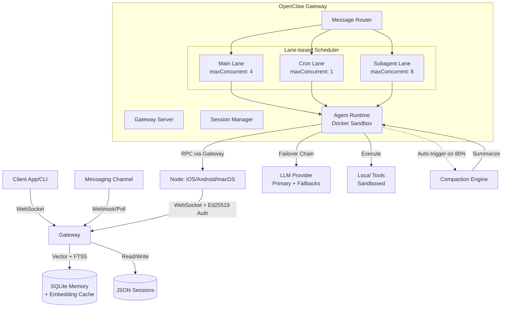

# System Architecture Overview

## High-Level Design

OpenClaw is a modular AI Gateway that bridges messaging platforms (Channels) with AI Agents. It acts as a central control plane, managing sessions, routing messages, and executing tools.



## Core Components

### 1. Gateway Server (`src/gateway/`)
The heart of the system. It exposes a WebSocket interface for clients (CLI, UI, Mobile) and manages the lifecycle of the application.
- **Protocol**: Custom JSON-based WebSocket protocol.
- **State**: In-memory mapping of active connections and sessions.
- **Discovery**: mDNS/Bonjour for local network discovery.

### 2. Channels (`extensions/`)
Pluggable adapters that connect to external messaging services (WhatsApp, Telegram, Slack, etc.).
- **Inbound**: Receives messages via webhooks or polling.
- **Outbound**: Sends messages via provider APIs.
- **Normalization**: Converts provider-specific events into standard OpenClaw `ChatEvent` objects.

### 3. Agent Runtime (`src/agents/`)
Executes the AI logic ("Pi Agent").
- **Loop**: Observation -> Thought -> Action -> Observation.
- **Context**: Manages conversation history and short-term memory.
- **Tools**: Executes local code (sandboxed) or calls external APIs.

### 4. Data Layer
- **Session Store**: JSON-based storage for chat history and session metadata.
- **Memory**: SQLite-based vector store for long-term memory (RAG).

## Data Flow

### Inbound Message
1.  **Channel** receives webhook from Provider (e.g., Twilio/Slack).
2.  **Channel** normalizes payload to `ChatEvent`.
3.  **Gateway** routes event to the correct `Session`.
4.  **Session** appends message to history.
5.  **Agent** is triggered (if active).

### Agent Execution
1.  **Agent** reads session history.
2.  **Agent** sends prompt to LLM.
3.  **LLM** returns response (text or tool call).
4.  **Agent** executes tool (if needed) or sends text response.
5.  **Gateway** routes response back to **Channel**.
6.  **Channel** calls Provider API to deliver message.

---

## Scheduling & Concurrency Control

OpenClaw uses a **Lane-based Queuing System** to manage concurrent agent execution while ensuring resource isolation and message ordering.

### Lane System Architecture

**Implementation**: `src/process/command-queue.ts`, `src/gateway/server-lanes.ts`

The system categorizes tasks into distinct **Lanes**, each with independent concurrency limits:

| Lane | Purpose | Default Concurrency | Configuration Path |
|:-----|:--------|:-------------------|:-------------------|
| **Main** | User-facing chat interactions | Config-adjustable | `agents.defaults.maxConcurrent` |
| **Subagent** | Nested agent tasks spawned by primary agents | Config-adjustable | `agents.defaults.subagent.maxConcurrent` |
| **Cron** | Background scheduled tasks | 1 (serialized) | `cron.maxConcurrentRuns` |
| **Nested** | Recursive agent operations | 1 (hard-coded) | N/A |

**Key Design Principle**: A slow cron job won't block main chat interactions. Each lane operates independently with its own FIFO queue and active task counter.

### Queue Implementation

```typescript
type LaneState = {
  lane: string;              // Lane identifier
  queue: QueueEntry[];       // FIFO queue of pending tasks
  active: number;            // Currently executing tasks
  maxConcurrent: number;     // Concurrency limit
  draining: boolean;         // Drain operation in progress
};
```

**Scheduling Algorithm** (`drainLane`):
```
WHILE (active < maxConcurrent && queue.length > 0):
    - Dequeue next task from head
    - active += 1
    - Execute task asynchronously
    - On completion: active -= 1, pump() to continue draining
```

### Message Ordering & Sequencing

**Challenge**: WebSocket streaming delivers agent responses (deltas, tool calls) asynchronously. How to maintain order?

**Solution** (`agentRunSeq`):
- Every agent run receives a unique `runId` (UUID)
- A global sequence map tracks message order: `Map<runId, seqNumber>`
- Each event increments the sequence counter
- Clients detect gaps and trigger "sequence error" alerts

**Implementation**: `src/gateway/server-runtime-state.ts`

### Task Cancellation

**Mechanism**: `chatAbortControllers` - a map of `runId → AbortController`

**Flow**:
1. User sends `/stop` or `chat.abort` RPC
2. Gateway retrieves `chatAbortControllers.get(runId)`
3. Calls `controller.abort()`
4. Agent receives signal and halts execution
5. Broadcasts `aborted` state to all connected clients

**Granularity**: Per-run cancellation without killing the entire process.

---

## Memory & Context Management

OpenClaw breaks through LLM context window limits using a **Hybrid Memory Architecture** combining session compaction and vector-based retrieval (RAG).

### Two-Tier Memory Model

#### Layer 1: Session History (Short-term)

**Storage**: JSON5 files at `~/.openclaw/sessions/{sessionId}.json`

**Contents**:
- Complete user/assistant conversation
- Tool call records (inputs/outputs)
- Metadata (timestamps, run IDs)

**Token Tracking**: Real-time estimation using `estimateTokens()` (rough heuristic: ~4 chars = 1 token)

#### Layer 2: Vector Memory (Long-term)

**Storage**: SQLite + `sqlite-vec` extension

**Purpose**: Semantic search across indexed codebase, documents, and past conversations

### Compaction System

**Trigger Conditions**:
1. **Context Threshold**: Estimated tokens exceed 80% of model's context window
2. **API Error**: `context_length_exceeded` exception
3. **Manual**: User invokes `/compact` command

**Implementation**: `src/agents/compaction.ts`

**Algorithm - Multi-Stage Summarization**:

```
Original History (N messages, ~50K tokens)
    ↓
Split into P parts based on BASE_CHUNK_RATIO (0.4)
    ↓
Summarize each part in parallel (LLM calls)
    ↓
Merge summaries (recursive if still too large)
    ↓
Final compressed result (~5-10K tokens)
```

**Adaptive Chunking**: If average message size exceeds 10% of context window, the chunk ratio drops toward `MIN_CHUNK_RATIO` (0.15) to ensure more aggressive compression.

**Information Preservation Strategy**:
- ✅ **Keep**: Decisions, TODOs, open questions, constraints
- ❌ **Drop**: Exploration process, redundant clarifications, temporary states

**Fallback**: If full summarization fails, the system attempts to summarize only "small" messages and annotates omitted oversized content.

### Hybrid RAG (Vector + Keyword Search)

**Implementation**: `src/memory/manager.ts`, `src/memory/hybrid.ts`

**Search Architecture**:

```
User Query: "How does authentication work?"
    ↓
[Vector Branch]                      [Keyword Branch]
Generate embedding                   Tokenize query → FTS5
    ↓                                     ↓
sqlite-vec cosine similarity         BM25 ranking
    ↓                                     ↓
Top-K results (scored 0-1)          Top-K results (scored 0-1)
    ↓                                     ↓
            Merge with weighted sum
                    ↓
            Inject into prompt as <context>
```

**Vector Search**:
- Uses `vec_distance_cosine` (cosine similarity)
- Fallback: Brute-force JS calculation if `sqlite-vec` unavailable

**Keyword Search**:
- SQLite FTS5 virtual table (`chunks_fts`)
- Query transformation: `"token1" AND "token2"` (quoted AND-join)
- BM25 scoring converted to 0-1 range via `1 / (1 + max(0, rank))`

**Hybrid Scoring**:
```typescript
finalScore = (vectorWeight × vectorScore) + (textWeight × textScore)
```

### Embedding Cache

**Purpose**: Avoid redundant API calls for identical content

**Storage**: SQLite table `embedding_cache`

**Key**: Composite primary key `(provider, model, provider_key, hash)`

**Strategy**:
- Content hashed before embedding request
- Cache lookup: if hash exists, reuse embedding
- Persistence: Cache survives across sessions
- **Cost Reduction**: 90%+ fewer embedding API calls

**Invalidation**: Automatic when file content changes (hash mismatch)

---

## Tool Invocation Architecture

OpenClaw's tool system bridges sandboxed agent execution with external system access through a **multi-hop WebSocket RPC** design.

### Agent → Gateway → Node Flow

**Scenario**: Agent needs to capture a photo using iPhone camera

```
[Agent Container]                 [Gateway]                    [Node: iPhone]
      |                              |                               |
      | 1. Call nodes tool           |                               |
      |   (command: camera.snap)     |                               |
      |----------------------------->|                               |
      |                              | 2. Lookup nodeId in registry  |
      |                              |                               |
      |                              | 3. node.invoke.request        |
      |                              |   (WebSocket RPC)             |
      |                              |------------------------------>|
      |                              |                               | 4. Execute camera.snap
      |                              |                               |    (native iOS API)
      |                              |                               |
      |                              | 5. node.invoke.result         |
      |                              |<------------------------------|
      | 6. Return result to agent    |                               |
      |<-----------------------------|                               |
```

**Implementation**:
- Agent side: `src/agents/tools/nodes-tool.ts`
- Gateway side: `src/gateway/server-methods/nodes.ts`
- Registry: `src/gateway/node-registry.ts`

### Permission Triple-Check

Every tool invocation undergoes three-layer validation:

#### 1. Authentication (Device Signature)
- **Method**: Ed25519 signature verification
- **Payload**: Device identity + `signedAt` timestamp (replay prevention)
- **Implementation**: `src/infra/device-identity.ts`

#### 2. Authorization (Pairing Token)
- **Mechanism**: Each node must be explicitly paired
- **Flow**: 
  1. New node connects → `device.pair.requested` broadcast
  2. User approves pairing → unique `pairingToken` issued
  3. Token persisted in `paired.json`
- **Enforcement**: Gateway checks `nodeId` against paired registry

#### 3. Command Allowlist
- **Policy**: `src/gateway/node-command-policy.ts`
- **Platform-specific**:
  - **macOS**: `system.run`, `system.which`, `browser.proxy`, `location.get`, `camera.*`
  - **iOS**: `canvas.*`, `camera.*`, `screen.record`, `location.get`
  - **Android**: iOS capabilities + `sms.send`
- **Double-check**: Command must be in platform allowlist AND declared by node in handshake

### Idempotency Protection

**Problem**: Network failures could cause duplicate executions

**Solution**: `idempotencyKey` per request
- Generated by agent before sending
- Stored in `NodeRegistry` pending map
- Duplicate requests with same key return cached result

### Docker Sandbox Isolation

**Configuration**: `src/agents/sandbox/docker.ts`

**Security Measures**:

| Feature | Configuration |
|:--------|:--------------|
| **Root Filesystem** | Read-only (`readOnlyRoot: true`) |
| **Security Profiles** | Seccomp, AppArmor |
| **Capabilities** | Explicit drops via `capDrop` |
| **Privileges** | `no-new-privileges` flag |
| **Resources** | `memory`, `cpus`, `pidsLimit`, `ulimits` |
| **Workspace** | Volume mount with optional `:ro` |

**Isolation Model**: Even if agent is compromised, it cannot:
- Modify host filesystem (read-only root)
- Escalate privileges (capability drops)
- Spawn excessive processes (PID limits)
- Directly access network (must route through Gateway)

---

## Model Selection & Failover

OpenClaw's resilience strategy handles model failures, quota limits, and provider-specific quirks through intelligent failover and adaptation.

### Thinking Level Auto-Downgrade

**Problem**: Strong reasoning models (GPT-4o, Opus) support `thinkingLevel: high`, but weaker models reject this parameter.

**Solution**: Automatic downgrade on error

**Flow**:
```
User config: thinkingLevel = "high"
    ↓
LLM returns 400 "Unsupported parameter"
    ↓
Parse error message for valid values
    ↓
Retry with: high → medium → low → minimal → off
    ↓
Success or abort
```

**Implementation**: `src/agents/pi-embedded-helpers/thinking.ts` (`pickFallbackThinkingLevel`)

### Multi-Tier Failover Chain

#### Tier 1: Auth Profile Rotation

**Trigger**: Rate limit (429), billing error (402), authentication failure

**Strategy**: Rotate to next auth profile for the same provider
- Each profile enters cooldown period on failure
- Prevents cascading quota exhaustion

#### Tier 2: Model Fallback

**Trigger**: Persistent errors, quota exhausted across all profiles

**Configuration**: `agents.defaults.model.fallbacks`

**Example**:
```json
{
  "model": "anthropic/claude-sonnet-3-5",
  "fallbacks": ["anthropic/claude-haiku-3-5", "openai/gpt-3.5-turbo"]
}
```

**Logic**: `src/agents/model-fallback.ts` (`runWithModelFallback`)
- Iterates through fallback chain
- Each model attempted with fresh auth profiles
- Fails only if entire chain exhausted

#### Tier 3: Auto-Compaction Before Failover

**Special Case**: `context_length_exceeded`

**Before** failing over to larger-context model:
1. Attempt session compaction (summarization)
2. Retry with compressed history
3. Only failover if compaction insufficient

**Benefit**: Avoids unnecessary model switch when context can be compressed

### Provider-Specific Adaptations

Different LLM providers have incompatible conversation formats. OpenClaw implements per-provider "turn validators":

#### Gemini Turn Validation
**Requirement**: Strict `user → assistant → tool → user` alternation

**Solution**: `validateGeminiTurns` (`src/agents/pi-embedded-helpers/turns.ts`)
- Merges consecutive assistant messages
- Inserts synthetic user message if transcript starts with assistant

#### Anthropic Turn Validation
**Requirement**: Alternating user/assistant roles

**Solution**: `validateAnthropicTurns`
- Merges consecutive user messages
- Ensures no two user/assistant messages in sequence

#### OpenAI Reasoning Block Patching
**Issue**: Trailing reasoning blocks without content blocks cause API rejection

**Solution**: `downgradeOpenAIReasoningBlocks` (`src/agents/pi-embedded-helpers/openai.ts`)
- Detects orphaned reasoning blocks
- Drops them before API submission

### Weak Model Compensation

**Challenge**: 8B-parameter models (Qwen, Llama) struggle with:
- Multi-step tool calling coherence
- JSON schema compliance
- Path resolution (relative vs absolute)

**Mitigation Strategies**:

1. **Explicit Prompt Engineering**: More detailed step-by-step instructions (vs abstract goal-setting for strong models)
2. **Few-Shot Examples**: Inject tool call examples in system prompt
3. **Runtime Info Injection**: Every turn includes current working directory, completed steps, remaining goals
4. **Workspace Notes**: Use `MEMORY.md` file as external "memory" for weak models to "take notes"
5. **Forced Sandbox**: Weak models MUST run in sandbox (prevent destructive operations from logic errors)

**Cost/Performance Trade-off**:
- Strong model (Sonnet) for main agent: Complex reasoning
- Weak model (Haiku) for subagents: Simple, well-defined tasks
- Reduces cost by 60-80% while maintaining reliability

### Model Capability Detection

**Auto-detection** (recommended implementation):

```typescript
function detectModelCapabilities(modelId: string) {
  const capabilities = {
    reasoning: false,
    vision: false,
    contextWindow: 8192,
  };
  
  if (modelId.includes('gpt-4') || modelId.includes('opus')) {
    capabilities.reasoning = true;
    capabilities.contextWindow = 128000;
  }
  
  if (modelId.includes('vision') || modelId.includes('gpt-4o')) {
    capabilities.vision = true;
  }
  
  return capabilities;
}
```

**Purpose**: Prevent wasted API calls by pre-filtering unsupported features

---

## Cross-References

For detailed implementation guides, see:
- [Scheduling & Concurrency](./scheduling.md) - Lane configuration and tuning
- [Memory Management](./memory-management.md) - Compaction algorithms and RAG integration
- [Model Performance](./model-performance.md) - Model capability matrix and optimization strategies

**Key Source Files**:
- Scheduling: `src/process/command-queue.ts`, `src/gateway/server-lanes.ts`
- Memory: `src/agents/compaction.ts`, `src/memory/manager.ts`, `src/memory/hybrid.ts`
- Tools: `src/agents/tools/nodes-tool.ts`, `src/gateway/server-methods/nodes.ts`
- Models: `src/agents/pi-embedded-runner/run.ts`, `src/agents/model-fallback.ts`
