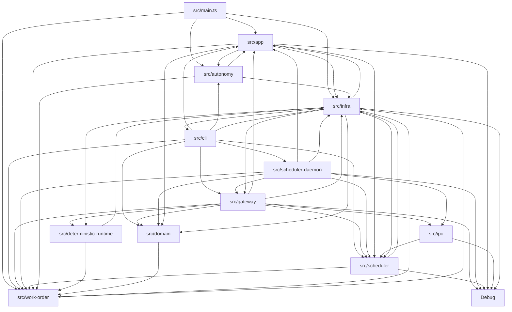
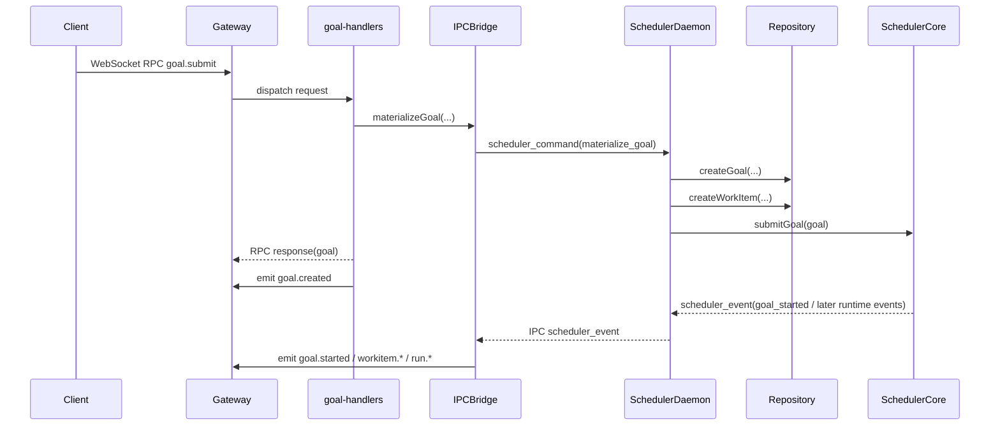
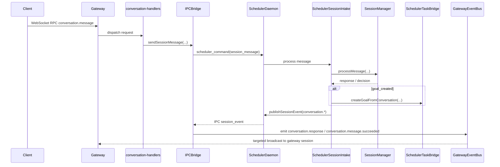
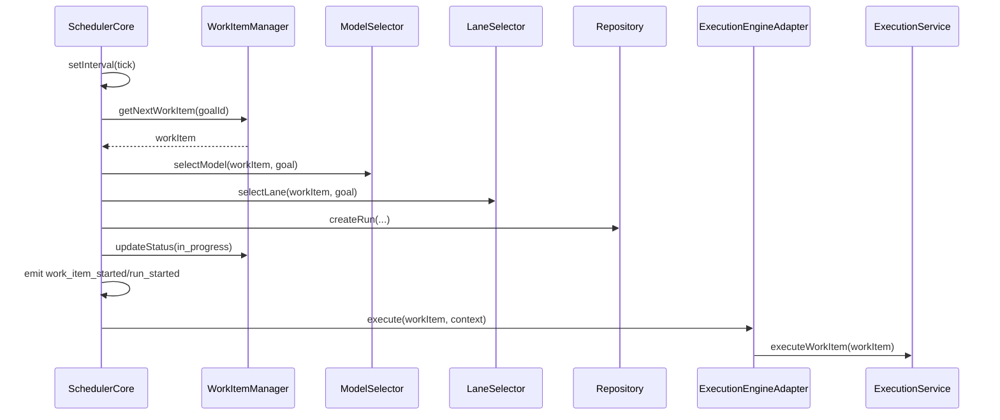
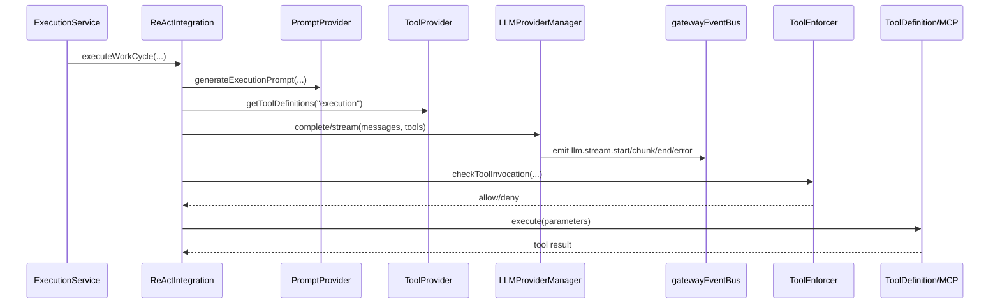
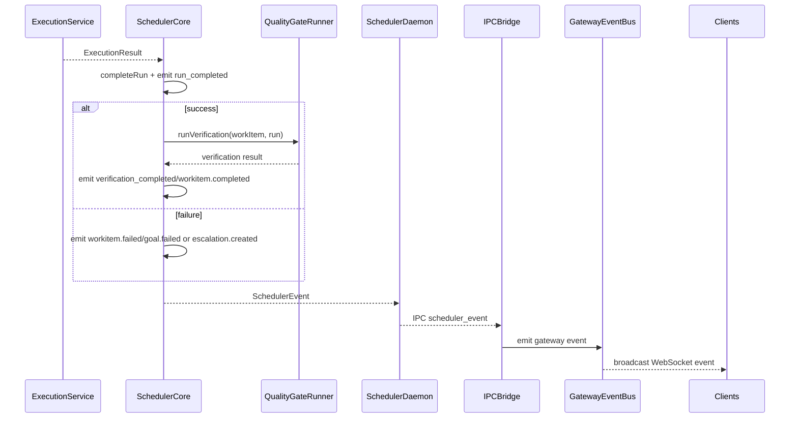

# Architecture Deep Analysis

This document extends the earlier architecture discovery pass with a deeper reconstruction of runtime coupling, implicit architecture, and boundary quality.

Scope:
- Source scanned across `src/`, `web/src/`, `debug-server/server/src/`, and `debug-server/webui/src/`
- Focused on runtime message flow, import coupling, singleton/shared state, and execution paths
- No code was modified

## 1. Event and Message Inventory

### 1.1 Key Findings

- The runtime is message-heavy at the edges but not internally decoupled. Most external interactions are RPC, IPC, WebSocket events, or DB-backed run events.
- The Gateway event bus is the main fan-out hub for client-visible state.
- `SchedulerCore` emits a small typed scheduler event set, but those events are translated into a larger Gateway event vocabulary by bridge layers.
- Debug events are stringly typed and effectively form a second event system parallel to the scheduler event stream.
- The LLM streaming path is coupled directly to the Gateway through `gatewayEventBus` imports inside infrastructure code.
- Several event names are declared in API types but have no active producer in the current codebase.

### 1.2 Gateway and Scheduler Lifecycle Events

These are the externally visible state-change events routed through the Gateway event bus and usually rebroadcast to WebSocket clients.

| Event | Producer | Consumers | Transport | Description |
|---|---|---|---|---|
| `goal.created` | `src/gateway/rpc/handlers/goal-handlers.ts`, legacy `src/gateway/integration/daemon-bridge.ts` | `BroadcastManager`, `GatewayServer` telemetry, `debug-handlers` event store, goal subscribers | In-memory event bus | Goal materialized and exposed to clients. |
| `goal.started` | `SchedulerCore` via `SchedulerBridge` or `SchedulerDaemon -> IPCBridge` | Same as above | Direct function call or IPC socket -> in-memory | Scheduler accepted goal into active processing. |
| `goal.updated` | Legacy `DaemonBridge` only | `BroadcastManager`, subscribers | In-memory event bus | Legacy daemon state update path. |
| `goal.completed` | `SchedulerCore` via bridge translation | `BroadcastManager`, telemetry, subscribers | Direct function call or IPC socket -> in-memory | Goal fully completed. |
| `goal.failed` | `SchedulerCore` via bridge translation | `BroadcastManager`, telemetry, subscribers | Direct function call or IPC socket -> in-memory | Goal failed or blocked. |
| `goal.cancelled` | `goal-handlers.ts`, legacy `DaemonBridge` | `BroadcastManager`, subscribers | In-memory event bus | User or system cancelled goal. |
| `goal.deleted` | `goal-handlers.ts` | `BroadcastManager`, subscribers | In-memory event bus | Goal removed from repository-facing view. |
| `workitem.created` | Legacy `DaemonBridge` | `BroadcastManager`, subscribers | In-memory event bus | Legacy work item creation event. |
| `workitem.started` | `SchedulerCore` via bridge translation | `BroadcastManager`, telemetry, subscribers | Direct function call or IPC socket -> in-memory | Work item execution started. |
| `workitem.in_progress` | `SchedulerCore` via bridge translation | `BroadcastManager`, telemetry, subscribers | Direct function call or IPC socket -> in-memory | Progress-stage updates during execution or verification. |
| `workitem.ended` | `SchedulerCore` via bridge translation | `BroadcastManager`, telemetry, subscribers | Direct function call or IPC socket -> in-memory | Terminal execution stage with outcome payload. |
| `workitem.updated` | Legacy `DaemonBridge` | `BroadcastManager`, subscribers | In-memory event bus | Legacy state update path. |
| `workitem.completed` | `SchedulerCore` via bridge translation, legacy `DaemonBridge` | `BroadcastManager`, subscribers | Direct function call or IPC socket -> in-memory | Work item reached `done`. |
| `workitem.failed` | `SchedulerCore` via bridge translation, legacy `DaemonBridge` | `BroadcastManager`, subscribers | Direct function call or IPC socket -> in-memory | Work item terminal failure. |
| `run.started` | `SchedulerCore` via bridge translation, legacy `DaemonBridge` | `BroadcastManager`, `GatewayServer` rollout telemetry, subscribers | Direct function call or IPC socket -> in-memory | Run created and execution began. |
| `run.completed` | `SchedulerCore` via bridge translation, legacy `DaemonBridge` | `BroadcastManager`, `GatewayServer` rollout telemetry, subscribers | Direct function call or IPC socket -> in-memory | Run completion payload including selected/actual model. |
| `verification.started` | `SchedulerCore` via bridge translation | `BroadcastManager`, subscribers | Direct function call or IPC socket -> in-memory | Verification phase started. |
| `verification.completed` | `SchedulerCore` via bridge translation | `BroadcastManager`, subscribers | Direct function call or IPC socket -> in-memory | Verification completed with pass/fail summary. |
| `budget.warning` | `SchedulerCore` via bridge translation | `BroadcastManager`, subscribers | Direct function call or IPC socket -> in-memory | Goal budget at warning or critical threshold. |
| `budget.exceeded` | `SchedulerCore` via bridge translation | `BroadcastManager`, subscribers | Direct function call or IPC socket -> in-memory | Goal budget exceeded. |
| `escalation.created` | `SchedulerCore` via bridge translation, legacy `DaemonBridge` | `BroadcastManager`, subscribers | Direct function call or IPC socket -> in-memory | Escalation created for blocked/error state. |
| `escalation.resolved` | `SchedulerCore` via bridge translation, `escalation-handlers.ts`, legacy `DaemonBridge` | `BroadcastManager`, subscribers | In-memory event bus or translated scheduler event | Escalation resolved or acknowledged. |

### 1.3 Conversation, Streaming, Approval, and Gateway Runtime Events

| Event | Producer | Consumers | Transport | Description |
|---|---|---|---|---|
| `conversation.new` | `SchedulerSessionIntake` | `BroadcastManager`, `GatewayServer` telemetry, targeted session | IPC socket -> in-memory -> WebSocket | Conversation session created. |
| `conversation.message.started` | `SchedulerSessionIntake` | `BroadcastManager`, targeted session | IPC socket -> in-memory -> WebSocket | User turn accepted for processing. |
| `conversation.response` | `SchedulerSessionIntake` | `BroadcastManager`, targeted session | IPC socket -> in-memory -> WebSocket | Streaming or final conversational response payload. |
| `conversation.message.succeeded` | `SchedulerSessionIntake` | `BroadcastManager`, `GatewayServer` telemetry, targeted session | IPC socket -> in-memory -> WebSocket | Turn finished successfully. |
| `conversation.ended` | `SchedulerSessionIntake` | `BroadcastManager`, targeted session | IPC socket -> in-memory -> WebSocket | Session ended. |
| `conversation.archived` | `SchedulerSessionIntake` | `BroadcastManager`, targeted session | IPC socket -> in-memory -> WebSocket | Session archived. |
| `conversation.resumed` | `SchedulerSessionIntake` | `BroadcastManager`, targeted session | IPC socket -> in-memory -> WebSocket | Archived session resumed. |
| `conversation.new.failed` | `src/gateway/rpc/handlers/conversation-handlers.ts` | `GatewayServer` telemetry, `debug-handlers` event store | In-memory event bus | Gateway-side failure creating a conversation. |
| `conversation.message.failed` | `src/gateway/rpc/handlers/conversation-handlers.ts` | `GatewayServer` telemetry, `debug-handlers` event store | In-memory event bus | Gateway-side failure sending a message. |
| `llm.stream.start` | `src/infra/llm/provider-manager/provider-manager.ts` | `BroadcastManager`, web/TUI clients | In-memory event bus | Start of provider-manager stream. |
| `llm.stream.chunk` | `src/infra/llm/provider-manager/provider-manager.ts` | `BroadcastManager`, web/TUI clients | In-memory event bus | Streaming chunk emitted during completion. |
| `llm.stream.end` | `src/infra/llm/provider-manager/provider-manager.ts` | `BroadcastManager`, web/TUI clients | In-memory event bus | Stream completed. |
| `llm.stream.error` | `src/infra/llm/provider-manager/provider-manager.ts` | `BroadcastManager`, web/TUI clients | In-memory event bus | Stream failed. |
| `approval.requested` | `src/gateway/rpc/handlers/approval-handlers.ts` | `debug-handlers` event store, subscribers if added | In-memory event bus | Human approval request created. |
| `approval.granted` | `src/gateway/rpc/handlers/approval-handlers.ts` | `debug-handlers` event store | In-memory event bus | Approval granted. |
| `approval.denied` | `src/gateway/rpc/handlers/approval-handlers.ts` | `debug-handlers` event store | In-memory event bus | Approval denied. |
| `escalation.retry_scheduled` | `src/gateway/rpc/handlers/escalation-handlers.ts` | `debug-handlers` event store | In-memory event bus | Retry scheduled after escalation response. |
| `connection.authenticated` | `src/gateway/connection/connection-manager.ts` | `GatewayServer` counters/telemetry, `debug-handlers` event store | In-memory event bus | WebSocket session authenticated. |
| `connection.disconnected` | `src/gateway/connection/connection-manager.ts` | `GatewayServer` counters/telemetry, `debug-handlers` event store | In-memory event bus | WebSocket session disconnected. |
| `channel.adapter.config.updated` | `src/gateway/gateway-server.ts` | `BroadcastManager`, clients | In-memory event bus -> WebSocket | Adapter configuration changed. |
| `channel.adapter.status.updated` | `src/gateway/gateway-server.ts` | `BroadcastManager`, clients | In-memory event bus -> WebSocket | Adapter runtime status changed. |
| `config.changed` | `src/gateway/gateway-server.ts` | `GatewayServer` internal subscribers | In-memory event bus | Runtime config file change noticed. |
| `runtime.retention.run` | `src/gateway/integration/ipc-bridge.ts` | `GatewayServer` metrics | IPC socket -> in-memory | Daemon retention/pruning result for run events. |

### 1.4 Debug Events

The debug system is stringly typed. `src/debug/debug.ts` emits canonical names, but `debug.custom(...)` allows arbitrary event names.

| Event | Producer | Consumers | Transport | Description |
|---|---|---|---|---|
| `goal.created` | `debug.goal.created(...)` | `SchedulerDaemon` IPC forwarder, `GatewayDebugBroadcaster` | In-memory debug emitter | Goal creation instrumentation. |
| `goal.status_changed` | `debug.goal.statusChanged(...)` | Same as above | In-memory debug emitter | Goal state transition instrumentation. |
| `goal.completed` | `debug.goal.completed(...)` | Same as above | In-memory debug emitter | Goal completion instrumentation. |
| `workitem.created` | `debug.workItem.created(...)` | Same as above | In-memory debug emitter | Work item creation instrumentation. |
| `workitem.status_changed` | `debug.workItem.statusChanged(...)` | Same as above | In-memory debug emitter | Work item state transition instrumentation. |
| `workitem.assigned` | `debug.workItem.assigned(...)` | Same as above | In-memory debug emitter | Work item assigned to lane/model instrumentation. |
| `run.started` | `debug.run.started(...)` | Same as above | In-memory debug emitter | Run start instrumentation. |
| `run.completed` | `debug.run.completed(...)` | Same as above | In-memory debug emitter | Run success instrumentation. |
| `run.failed` | `debug.run.failed(...)` | Same as above | In-memory debug emitter | Run failure instrumentation. |
| `llm.request` | `debug.llm.request(...)` | Same as above | In-memory debug emitter | LLM call request instrumentation. |
| `llm.response` | `debug.llm.response(...)` | Same as above | In-memory debug emitter | LLM response instrumentation. |
| `llm.error` | `debug.llm.error(...)` | Same as above | In-memory debug emitter | LLM error instrumentation. |
| `llm.tokens` | `debug.llm.tokens(...)` | Same as above | In-memory debug emitter | Token usage instrumentation. |
| `tool.invoke` | `debug.tool.invoke(...)` | Same as above | In-memory debug emitter | Tool call started. |
| `tool.result` | `debug.tool.result(...)` | Same as above | In-memory debug emitter | Tool call succeeded. |
| `tool.error` | `debug.tool.error(...)` | Same as above | In-memory debug emitter | Tool call failed. |
| `state.transition` | `debug.state.transition(...)` | Same as above | In-memory debug emitter | General state machine transition. |
| `system.startup` | `debug.system.startup(...)` | Same as above | In-memory debug emitter | Process startup instrumentation. |
| `system.shutdown` | `debug.system.shutdown(...)` | Same as above | In-memory debug emitter | Process shutdown instrumentation. |
| `system.error` | `debug.system.error(...)` | Same as above | In-memory debug emitter | Fatal or system-level error instrumentation. |
| `debug.custom(<string>)` | Any module calling `debug.custom(...)` | Same as above | In-memory debug emitter | Open-ended custom instrumentation surface. |

### 1.5 IPC Socket Message Types

Defined in `src/ipc/types.ts`.

| Event | Producer | Consumers | Transport | Description |
|---|---|---|---|---|
| `connect` | `SchedulerDaemon` IPC client | Gateway IPC server | IPC socket | Client announces identity on connection. |
| `disconnect` | `SchedulerDaemon` IPC client | Gateway IPC server | IPC socket | Graceful daemon disconnect. |
| `ping` | Gateway IPC server | Scheduler daemon | IPC socket | Keepalive. |
| `pong` | Scheduler daemon | Gateway IPC server | IPC socket | Keepalive acknowledgement. |
| `scheduler_event` | `SchedulerDaemon.handleSchedulerEvent` | `IPCBridge.handleSchedulerEvent` | IPC socket | Typed scheduler lifecycle event. |
| `session_event` | `SchedulerSessionIntake.publishEvent` | `IPCBridge.handleSessionEvent` | IPC socket | Session-scoped conversation event targeted at a gateway session. |
| `debug_event` | `SchedulerDaemon.handleDebugEvent` | `IPCBridge.handleDebugEvent` | IPC socket | Debug instrumentation event. |
| `run_event_retention` | `SchedulerDaemon` retention job | `IPCBridge.handleRunEventRetention` | IPC socket | Retention/pruning outcome for `run_events`. |
| `scheduler_command` | Gateway `IPCBridge.sendSchedulerCommand` | `SchedulerDaemon.handleSchedulerCommand` | IPC socket | Gateway-to-daemon request. |
| `scheduler_command_result` | `SchedulerDaemon.handleSchedulerCommand` | `IPCBridge.handleSchedulerCommandResult` | IPC socket | Response to a scheduler command. |

### 1.6 Gateway-to-Scheduler Command Messages

These are the typed IPC request names used between Gateway RPC handlers and the daemon.

| Event | Producer | Consumers | Transport | Description |
|---|---|---|---|---|
| `materialize_goal` | `goal-handlers.ts` | `SchedulerDaemon` | IPC socket | Create goal and initial work item in daemon-owned flow. |
| `submit_goal` | `goal-handlers.ts`, `IPCBridge.submitGoal()` | `SchedulerDaemon` | IPC socket | Submit an existing goal to `SchedulerCore`. |
| `cancel_goal` | `goal-handlers.ts` | `SchedulerDaemon` | IPC socket | Cancel a goal in daemon-owned flow. |
| `apply_runtime_rollout` | `system-handlers.ts` | `SchedulerDaemon` | IPC socket | Update deterministic-runtime rollout settings. |
| `set_agent_model_override` | `system-handlers.ts` | `SchedulerDaemon` | IPC socket | Persist model override for an agent. |
| `get_agent_model_override` | `system-handlers.ts` | `SchedulerDaemon` | IPC socket | Read current agent model override. |
| `session_open` | `conversation-handlers.ts` | `SchedulerSessionIntake` via daemon | IPC socket | Open a conversation session. |
| `session_list` | `conversation-handlers.ts` | `SchedulerSessionIntake` via daemon | IPC socket | List sessions. |
| `session_message` | `conversation-handlers.ts` | `SchedulerSessionIntake` via daemon | IPC socket | Process a conversational turn. |
| `session_history` | `conversation-handlers.ts` | `SchedulerSessionIntake` via daemon | IPC socket | Load conversation history. |
| `session_end` | `conversation-handlers.ts` | `SchedulerSessionIntake` via daemon | IPC socket | End session. |
| `session_archive` | `conversation-handlers.ts` | `SchedulerSessionIntake` via daemon | IPC socket | Archive session. |
| `session_resume` | `conversation-handlers.ts` | `SchedulerSessionIntake` via daemon | IPC socket | Resume archived session. |
| `session_status` | `conversation-handlers.ts` | `SchedulerSessionIntake` via daemon | IPC socket | Load session status. |

### 1.7 Deterministic `run_events` Stored in the Database

Defined in `src/deterministic-runtime/run-events.ts` and stored in the `run_events` table in `src/infra/persistence/schema.sql`.

| Event | Producer | Consumers | Transport | Description |
|---|---|---|---|---|
| `PLAN_COMPILE_REQUESTED` | Internal runtime handlers / plan compiler path | `internal.runs.events`, timeline/replay RPCs, retention job | Database | Plan compilation requested. |
| `PLAN_COMPILE_COMPLETED` | Plan compiler | Same as above | Database | Plan compilation succeeded. |
| `PLAN_COMPILE_FAILED` | Plan compiler | Same as above | Database | Plan compilation failed. |
| `RUN_CREATED` | Internal runtime handlers / run event store | Same as above | Database | Deterministic run created. |
| `RUN_LINKED` | Internal runtime handlers | Same as above | Database | Related runs linked in runtime timeline. |
| `REPLAY_REEXECUTION_REQUESTED` | Replay path | Same as above | Database | Replay/re-execution requested. |
| `REPLAY_REEXECUTION_STEP_EXECUTED` | Replay path | Same as above | Database | Replay step actually executed. |
| `REPLAY_REEXECUTION_STEP_SKIPPED` | Replay path | Same as above | Database | Replay step skipped. |
| `REPLAY_REEXECUTION_COMPLETED` | Replay path | Same as above | Database | Replay finished. |

### 1.8 Subagent Process Messages

Defined in `src/infra/agents/subagent-protocol.ts`.

| Event | Producer | Consumers | Transport | Description |
|---|---|---|---|---|
| `init` | `SubagentProcessManager` | `subagent-worker.ts` | Process IPC | Initialize a child subagent process. |
| `shutdown` | `SubagentProcessManager` | `subagent-worker.ts` | Process IPC | Request worker shutdown. |
| `ready` | `subagent-worker.ts` | `SubagentProcessManager` | Process IPC | Child is initialized and ready. |
| `heartbeat` | `subagent-worker.ts` | `SubagentProcessManager` | Process IPC | Liveness signal for child supervision. |
| `shutdown_ack` | `subagent-worker.ts` | `SubagentProcessManager` | Process IPC | Graceful shutdown acknowledgement. |

### 1.9 Debug Server Replay Messages

Defined in `debug-server/server/src/types.ts`.

| Event | Producer | Consumers | Transport | Description |
|---|---|---|---|---|
| `replay.start` | Debug replay web UI | Debug server replay session | WebSocket | Start replay for a goal/timeline. |
| `replay.pause` | Debug replay web UI | Debug server replay session | WebSocket | Pause replay. |
| `replay.resume` | Debug replay web UI | Debug server replay session | WebSocket | Resume replay. |
| `replay.seek` | Debug replay web UI | Debug server replay session | WebSocket | Seek replay timestamp. |
| `replay.step` | Debug replay web UI | Debug server replay session | WebSocket | Step replay forward/backward. |
| `replay.speed` | Debug replay web UI | Debug server replay session | WebSocket | Change replay speed. |
| `replay.stop` | Debug replay web UI | Debug server replay session | WebSocket | Stop replay. |
| `replay.event` | Debug server replay session | Debug replay web UI | WebSocket | Single replay event frame. |
| `replay.batch` | Debug server replay session | Debug replay web UI | WebSocket | Batch replay event frame. |
| `replay.complete` | Debug server replay session | Debug replay web UI | WebSocket | Replay finished. |
| `replay.error` | Debug server replay session | Debug replay web UI | WebSocket | Replay failure. |

### 1.10 Gateway RPC Method Inventory

All of these are request messages carried over the Gateway WebSocket RPC protocol. Producer is any authenticated client: CLI, TUI, web UI, debug tooling, or local scripts.

| Event | Producer | Consumers | Transport | Description |
|---|---|---|---|---|
| `system.ping` | Client | `GatewayServer` built-in RPC handler | WebSocket RPC | Health check. |
| `system.methods` | Client | `GatewayServer` built-in RPC handler | WebSocket RPC | Discover callable methods. |
| `system.stats` | Client | `GatewayServer` built-in RPC handler | WebSocket RPC | Gateway stats. |
| `abort.register` | Client | `abort-handlers.ts` | WebSocket RPC | Register abort controller. |
| `abort.request` | Client | `abort-handlers.ts` | WebSocket RPC | Abort a scope. |
| `abort.check` | Client | `abort-handlers.ts` | WebSocket RPC | Check abort state. |
| `abort.unregister` | Client | `abort-handlers.ts` | WebSocket RPC | Remove abort registration. |
| `abort.children` | Client | `abort-handlers.ts` | WebSocket RPC | Abort child scopes. |
| `abort.list` | Client | `abort-handlers.ts` | WebSocket RPC | List registrations. |
| `abort.stats` | Client | `abort-handlers.ts` | WebSocket RPC | Abort manager stats. |
| `abort.clear` | Client | `abort-handlers.ts` | WebSocket RPC | Clear abort registrations. |
| `approval.list` | Client | `approval-handlers.ts` | WebSocket RPC | List approvals. |
| `approval.get` | Client | `approval-handlers.ts` | WebSocket RPC | Get approval. |
| `approval.grant` | Client | `approval-handlers.ts` | WebSocket RPC | Grant approval. |
| `approval.deny` | Client | `approval-handlers.ts` | WebSocket RPC | Deny approval. |
| `approval.pending` | Client | `approval-handlers.ts` | WebSocket RPC | List pending approvals. |
| `approval.create` | Client | `approval-handlers.ts` | WebSocket RPC | Create approval request. |
| `audit.list` | Client | `audit-handlers.ts` | WebSocket RPC | List audit records. |
| `audit.byGoal` | Client | `audit-handlers.ts` | WebSocket RPC | Audit records by goal. |
| `audit.byEntity` | Client | `audit-handlers.ts` | WebSocket RPC | Audit records by entity. |
| `audit.byAction` | Client | `audit-handlers.ts` | WebSocket RPC | Audit records by action. |
| `audit.byTimeRange` | Client | `audit-handlers.ts` | WebSocket RPC | Audit records by time range. |
| `audit.byActor` | Client | `audit-handlers.ts` | WebSocket RPC | Audit records by actor. |
| `audit.stats` | Client | `audit-handlers.ts` | WebSocket RPC | Audit summary stats. |
| `audit.prune` | Client | `audit-handlers.ts` | WebSocket RPC | Audit retention operation. |
| `clarify.analyze` | Client | `clarify-handlers.ts` | WebSocket RPC | Analyze clarification need. |
| `clarify.generate` | Client | `clarify-handlers.ts` | WebSocket RPC | Generate clarification questions. |
| `clarify.init` | Client | `clarify-handlers.ts` | WebSocket RPC | Initialize clarification state. |
| `clarify.respond` | Client | `clarify-handlers.ts` | WebSocket RPC | Submit clarification answer. |
| `clarify.process` | Client | `clarify-handlers.ts` | WebSocket RPC | Process clarification cycle. |
| `clarify.skip` | Client | `clarify-handlers.ts` | WebSocket RPC | Skip clarification. |
| `clarify.state` | Client | `clarify-handlers.ts` | WebSocket RPC | Load clarification state. |
| `clarify.isComplete` | Client | `clarify-handlers.ts` | WebSocket RPC | Check clarification completion. |
| `conversation.new` | Client | `conversation-handlers.ts` | WebSocket RPC | Open conversation session. |
| `conversation.list` | Client | `conversation-handlers.ts` | WebSocket RPC | List conversation sessions. |
| `conversation.message` | Client | `conversation-handlers.ts` | WebSocket RPC | Send message into conversation flow. |
| `conversation.history` | Client | `conversation-handlers.ts` | WebSocket RPC | Load turn history. |
| `conversation.end` | Client | `conversation-handlers.ts` | WebSocket RPC | End session. |
| `conversation.archive` | Client | `conversation-handlers.ts` | WebSocket RPC | Archive session. |
| `conversation.resume` | Client | `conversation-handlers.ts` | WebSocket RPC | Resume session. |
| `conversation.status` | Client | `conversation-handlers.ts` | WebSocket RPC | Load session status. |
| `debug.snapshot` | Client | `debug-handlers.ts` | WebSocket RPC | Snapshot runtime state. |
| `debug.scheduler` | Client | `debug-handlers.ts` | WebSocket RPC | Scheduler debug snapshot. |
| `debug.lanes` | Client | `debug-handlers.ts` | WebSocket RPC | Lane status debug view. |
| `debug.goals` | Client | `debug-handlers.ts` | WebSocket RPC | Debug goal listing. |
| `debug.goal` | Client | `debug-handlers.ts` | WebSocket RPC | Debug single goal. |
| `debug.workitems` | Client | `debug-handlers.ts` | WebSocket RPC | Debug work item listing. |
| `debug.runs` | Client | `debug-handlers.ts` | WebSocket RPC | Debug run listing. |
| `debug.events` | Client | `debug-handlers.ts` | WebSocket RPC | Read captured event store. |
| `debug.events.subscribe` | Client | `debug-handlers.ts` | WebSocket RPC | Subscribe to event stream. |
| `debug.events.unsubscribe` | Client | `debug-handlers.ts` | WebSocket RPC | Unsubscribe from event stream. |
| `debug.gateway` | Client | `debug-handlers.ts` | WebSocket RPC | Gateway debug data. |
| `escalation.list` | Client | `escalation-handlers.ts` | WebSocket RPC | List escalations. |
| `escalation.get` | Client | `escalation-handlers.ts` | WebSocket RPC | Get escalation. |
| `escalation.respond` | Client | `escalation-handlers.ts` | WebSocket RPC | Respond to escalation. |
| `escalation.pending` | Client | `escalation-handlers.ts` | WebSocket RPC | List pending escalations. |
| `escalation.packet.validate` | Client | `escalation-packet-handlers.ts` | WebSocket RPC | Validate submission packet. |
| `escalation.packet.canSubmit` | Client | `escalation-packet-handlers.ts` | WebSocket RPC | Check packet completeness. |
| `escalation.packet.build` | Client | `escalation-packet-handlers.ts` | WebSocket RPC | Build escalation packet. |
| `escalation.packet.requiredFields` | Client | `escalation-packet-handlers.ts` | WebSocket RPC | Required escalation fields. |
| `goal.submit` | Client | `goal-handlers.ts` | WebSocket RPC | Materialize and submit goal. |
| `agent.command.submit` | Client | `goal-handlers.ts` | WebSocket RPC | Turn an agent command into a goal. |
| `goal.status` | Client | `goal-handlers.ts` | WebSocket RPC | Load goal status. |
| `goal.cancel` | Client | `goal-handlers.ts` | WebSocket RPC | Cancel goal. |
| `goal.delete` | Client | `goal-handlers.ts` | WebSocket RPC | Delete goal. |
| `goal.list` | Client | `goal-handlers.ts` | WebSocket RPC | List goals. |
| `goal.subscribe` | Client | `goal-handlers.ts` | WebSocket RPC | Subscribe to goal events. |
| `goal.unsubscribe` | Client | `goal-handlers.ts` | WebSocket RPC | Unsubscribe from goal events. |
| `goal.tools.init` | Client | `goal-tool-handlers.ts` | WebSocket RPC | Initialize goal tool policy. |
| `goal.tools.check` | Client | `goal-tool-handlers.ts` | WebSocket RPC | Check tool policy. |
| `goal.tools.allow` | Client | `goal-tool-handlers.ts` | WebSocket RPC | Allow goal tool. |
| `goal.tools.disallow` | Client | `goal-tool-handlers.ts` | WebSocket RPC | Disallow goal tool. |
| `goal.tools.block` | Client | `goal-tool-handlers.ts` | WebSocket RPC | Block tool for goal. |
| `goal.tools.unblock` | Client | `goal-tool-handlers.ts` | WebSocket RPC | Remove tool block. |
| `goal.tools.setLayer` | Client | `goal-tool-handlers.ts` | WebSocket RPC | Set responsibility layer. |
| `goal.tools.getLayer` | Client | `goal-tool-handlers.ts` | WebSocket RPC | Get responsibility layer. |
| `goal.tools.setAll` | Client | `goal-tool-handlers.ts` | WebSocket RPC | Bulk tool policy update. |
| `goal.tools.list` | Client | `goal-tool-handlers.ts` | WebSocket RPC | List effective tool policy. |
| `goal.tools.filter` | Client | `goal-tool-handlers.ts` | WebSocket RPC | Filter allowed tools. |
| `goal.tools.history` | Client | `goal-tool-handlers.ts` | WebSocket RPC | Goal tool policy change history. |
| `goal.tools.remove` | Client | `goal-tool-handlers.ts` | WebSocket RPC | Remove goal tool policy. |
| `goal.tools.defaults.list` | Client | `goal-tool-handlers.ts` | WebSocket RPC | Default tool allow/block policy. |
| `goal.tools.defaults.addAllowed` | Client | `goal-tool-handlers.ts` | WebSocket RPC | Add default allowed tool. |
| `goal.tools.defaults.addBlocked` | Client | `goal-tool-handlers.ts` | WebSocket RPC | Add default blocked tool. |
| `internal.runtime.config` | Client | `internal-runtime-handlers.ts` | WebSocket RPC | Deterministic runtime config snapshot. |
| `internal.plan.get` | Client | `internal-runtime-handlers.ts` | WebSocket RPC | Fetch compiled/internal plan. |
| `internal.plan.compile` | Client | `internal-runtime-handlers.ts` | WebSocket RPC | Compile plan. |
| `internal.run.create` | Client | `internal-runtime-handlers.ts` | WebSocket RPC | Create deterministic run. |
| `internal.runs.events` | Client | `internal-runtime-handlers.ts` | WebSocket RPC | List run events. |
| `internal.runs.events.prune` | Client | `internal-runtime-handlers.ts` | WebSocket RPC | Prune run events. |
| `internal.runs.timeline` | Client | `internal-runtime-handlers.ts` | WebSocket RPC | Build run timeline. |
| `internal.runs.replay` | Client | `internal-runtime-handlers.ts` | WebSocket RPC | Replay deterministic run. |
| `internal.runtime.executeDryRun` | Client | `internal-runtime-handlers.ts` | WebSocket RPC | Execute dry-run path. |
| `internal.run.get` | Client | `internal-runtime-handlers.ts` | WebSocket RPC | Load internal run. |
| `internal.runs.byWorkItem` | Client | `internal-runtime-handlers.ts` | WebSocket RPC | Find runs by work item. |
| `internal.toolManifest.validate` | Client | `internal-runtime-handlers.ts` | WebSocket RPC | Validate tool manifest. |
| `os.permission.check` | Client | `os-permission-handlers.ts` | WebSocket RPC | Check OS permission state. |
| `os.permission.request` | Client | `os-permission-handlers.ts` | WebSocket RPC | Request OS permission. |
| `os.permission.grant` | Client | `os-permission-handlers.ts` | WebSocket RPC | Grant OS permission. |
| `os.permission.deny` | Client | `os-permission-handlers.ts` | WebSocket RPC | Deny OS permission. |
| `os.permission.revoke` | Client | `os-permission-handlers.ts` | WebSocket RPC | Revoke OS permission. |
| `os.permission.revokeAll` | Client | `os-permission-handlers.ts` | WebSocket RPC | Revoke all OS permissions. |
| `os.permission.list` | Client | `os-permission-handlers.ts` | WebSocket RPC | List OS permissions. |
| `os.permission.pending` | Client | `os-permission-handlers.ts` | WebSocket RPC | List pending OS permissions. |
| `os.service.available` | Client | `os-permission-handlers.ts` | WebSocket RPC | Check OS permission service availability. |
| `os.service.list` | Client | `os-permission-handlers.ts` | WebSocket RPC | List supported OS permission services. |
| `permission.list` | Client | `permission-handlers.ts` | WebSocket RPC | List permissions. |
| `permission.get` | Client | `permission-handlers.ts` | WebSocket RPC | Get permission request. |
| `permission.approve` | Client | `permission-handlers.ts` | WebSocket RPC | Approve permission request. |
| `permission.deny` | Client | `permission-handlers.ts` | WebSocket RPC | Deny permission request. |
| `permission.revoke` | Client | `permission-handlers.ts` | WebSocket RPC | Revoke permission. |
| `permission.revokeAll` | Client | `permission-handlers.ts` | WebSocket RPC | Revoke all permissions. |
| `permission.check` | Client | `permission-handlers.ts` | WebSocket RPC | Check permission state. |
| `permission.stats` | Client | `permission-handlers.ts` | WebSocket RPC | Permission stats. |
| `permission.layers` | Client | `permission-handlers.ts` | WebSocket RPC | List responsibility layers. |
| `permission.cleanup` | Client | `permission-handlers.ts` | WebSocket RPC | Cleanup expired permission state. |
| `persona.list` | Client | `persona-handlers.ts` | WebSocket RPC | List personas. |
| `persona.get` | Client | `persona-handlers.ts` | WebSocket RPC | Get persona. |
| `persona.default` | Client | `persona-handlers.ts` | WebSocket RPC | Get default persona id. |
| `stuck.checkAll` | Client | `stuck-detection-handlers.ts` | WebSocket RPC | Check all goals/work items for stuck conditions. |
| `stuck.checkWorkItem` | Client | `stuck-detection-handlers.ts` | WebSocket RPC | Check one work item. |
| `stuck.checkAllRuns` | Client | `stuck-detection-handlers.ts` | WebSocket RPC | Check all runs. |
| `stuck.checkRun` | Client | `stuck-detection-handlers.ts` | WebSocket RPC | Check one run. |
| `stuck.detectCycles` | Client | `stuck-detection-handlers.ts` | WebSocket RPC | Detect dependency cycles. |
| `stuck.analyzeErrors` | Client | `stuck-detection-handlers.ts` | WebSocket RPC | Analyze repeated errors. |
| `stuck.acknowledge` | Client | `stuck-detection-handlers.ts` | WebSocket RPC | Acknowledge stuck record. |
| `stuck.config.get` | Client | `stuck-detection-handlers.ts` | WebSocket RPC | Get stuck detection config. |
| `stuck.config.update` | Client | `stuck-detection-handlers.ts` | WebSocket RPC | Update stuck detection config. |
| `system.capabilities` | Client | `system-handlers.ts` | WebSocket RPC | Scheduler capability snapshot. |
| `system.status` | Client | `system-handlers.ts` | WebSocket RPC | System status overview. |
| `system.runtime.rollout.status` | Client | `system-handlers.ts` | WebSocket RPC | Runtime rollout status. |
| `system.runtime.rollout.update` | Client | `system-handlers.ts` | WebSocket RPC | Update rollout. |
| `system.runtime.tui.update` | Client | `system-handlers.ts` | WebSocket RPC | Update TUI/runtime flags. |
| `system.channels.status` | Client | `system-handlers.ts` | WebSocket RPC | Channel adapter status. |
| `system.channels.update` | Client | `system-handlers.ts` | WebSocket RPC | Update channel adapters. |
| `system.channels.events` | Client | `system-handlers.ts` | WebSocket RPC | Read stored channel events. |
| `system.agent.model_override.set` | Client | `system-handlers.ts` | WebSocket RPC | Set agent model override. |
| `system.agent.model_hint.set` | Client | `system-handlers.ts` | WebSocket RPC | Set agent model hint. |
| `system.agent.model_override.get` | Client | `system-handlers.ts` | WebSocket RPC | Read agent model override. |
| `system.agent.model_hint.get` | Client | `system-handlers.ts` | WebSocket RPC | Read agent model hint. |
| `workitem.get` | Client | `workitem-handlers.ts` | WebSocket RPC | Get work item. |
| `workitem.list` | Client | `workitem-handlers.ts` | WebSocket RPC | List work items. |
| `workitem.byGoal` | Client | `workitem-handlers.ts` | WebSocket RPC | Work items by goal. |
| `workitem.runs` | Client | `workitem-handlers.ts` | WebSocket RPC | Runs for a work item. |
| `workitem.retry` | Client | `workitem-handlers.ts` | WebSocket RPC | Retry a failed work item. |

### 1.11 Declared but Currently Unproduced Gateway Event Types

These event names appear in Gateway API types but no active producer was located in the current runtime code.

| Event | Status |
|---|---|
| `conversation.typing` | Declared in Gateway/web types, no producer found. |
| `task.narration` | Declared in Gateway/web types, no producer found. |
| `task.result` | Declared in Gateway/web types, no producer found. |

## 2. Import Dependency Graph

### 2.1 Architectural Reading of the Graph

- The `src/` tree is not layered in practice. It forms one large strongly connected component spanning `app`, `autonomy`, `cli`, `deterministic-runtime`, `domain`, `gateway`, `infra`, `ipc`, `scheduler`, `scheduler-daemon`, and `work-order`.
- `src/infra` is the dominant dependency hub. It is both the most imported module and the widest outward importer.
- `src/work-order` behaves like a shared kernel for types, but it is not isolated because `src/work-order/database/manager.ts` imports infrastructure repository code, creating a back-edge.
- `src/domain` is not pure in the dependency graph because it depends on `src/work-order`.
- `src/gateway` and `src/scheduler-daemon` both reach deeply into `app`, `infra`, and `scheduler`, which means the process boundary does not correspond to a clean code boundary.
- The debug server code is comparatively cleaner and mostly acyclic.
- The web client has a local cycle between `web/components` and `web/hooks`.

### 2.2 Top-Level Module Dependency Graph

### 2.3 Top-Level Dependency List

| Module | Depends On |
|---|---|
| `src/main.ts` | `src/app`, `src/autonomy`, `src/infra`, `src/work-order` |
| `src/cli` | `src/app`, `src/autonomy`, `src/domain`, `src/gateway`, `src/infra`, `src/scheduler`, `src/scheduler-daemon`, `src/work-order` |
| `src/gateway` | `src/app`, `src/debug`, `src/deterministic-runtime`, `src/domain`, `src/infra`, `src/ipc`, `src/scheduler`, `src/work-order` |
| `src/scheduler-daemon` | `src/app`, `src/debug`, `src/domain`, `src/gateway`, `src/infra`, `src/ipc`, `src/scheduler`, `src/work-order` |
| `src/scheduler` | `src/debug`, `src/infra`, `src/work-order` |
| `src/app` | `src/autonomy`, `src/debug`, `src/domain`, `src/infra`, `src/scheduler`, `src/work-order` |
| `src/autonomy` | `src/app`, `src/infra`, `src/work-order` |
| `src/deterministic-runtime` | `src/infra`, `src/work-order` |
| `src/ipc` | `src/debug`, `src/scheduler` |
| `src/domain` | `src/work-order` |
| `src/work-order` | `src/infra` |
| `src/infra` | `src/app`, `src/cli`, `src/debug`, `src/deterministic-runtime`, `src/domain`, `src/gateway`, `src/scheduler`, `src/work-order` |
| `web/app` | `web/components`, `web/lib`, `web/types` |
| `web/components` | `web/hooks`, `web/lib` |
| `web/hooks` | `web/components`, `web/lib` |
| `debug-server/server/debug-server.ts` | `api-server.ts`, `event-collector.ts`, `gateway-client.ts`, `store`, `token-manager.ts` |
| `debug-server/server/api-server.ts` | `event-collector.ts`, `replay`, `store`, `types.ts` |
| `debug-server/server/event-collector.ts` | `events`, `store`, `types.ts` |

### 2.4 Largest Dependency Hubs

Counts below are top-level module degree counts from the import graph.

| Module | Outbound | Inbound | Total | Notes |
|---|---:|---:|---:|---|
| `src/infra` | 8 | 66 | 74 | Primary import hub and largest coupling surface. |
| `src/work-order` | 1 | 71 | 72 | Shared kernel for types, but not isolated. |
| `src/domain` | 1 | 44 | 45 | Type/domain hub with back-pressure from work-order coupling. |
| `src/app` | 6 | 17 | 23 | Application layer but not protected. |
| `src/scheduler` | 3 | 17 | 20 | Core orchestrator, imported by many layers. |
| `src/cli` | 8 | 4 | 12 | Entry layer that reaches deep into internals. |
| `src/gateway` | 8 | 3 | 11 | Boundary layer with many internal dependencies. |
| `src/debug` | 0 | 10 | 10 | Purely consumed singleton/event module. |
| `src/scheduler-daemon` | 8 | 1 | 9 | Process module with wide reach. |

### 2.5 Circular Dependencies

Detected strongly connected components:

| Cycle | Notes |
|---|---|
| `src/app`, `src/autonomy`, `src/cli`, `src/deterministic-runtime`, `src/domain`, `src/gateway`, `src/infra`, `src/ipc`, `src/scheduler`, `src/scheduler-daemon`, `src/work-order` | The main runtime codebase is effectively one large cycle at module level. |
| `web/components`, `web/hooks` | Local UI cycle. |

### 2.6 Cross-Layer Dependency Violations

Representative examples:

| Import Edge | Why It Matters |
|---|---|
| `src/infra/llm/* -> src/cli/lib/auth-manager-v2.ts` | Infrastructure depends on CLI authentication implementation. |
| `src/infra/llm/provider-manager/provider-manager.ts -> src/gateway/events/event-bus.ts` | Infrastructure emits Gateway events directly. |
| `src/app/lifecycle/planning/planning-service.ts -> src/scheduler/model-selector/*` | Application layer imports scheduler implementation/types. |
| `src/gateway/rpc/handlers/persona-handlers.ts -> src/app/conversation/persona-engine.ts` | Gateway reaches directly into app service internals. |
| `src/scheduler-daemon/daemon.ts -> src/gateway/integration/scheduler-factory.ts` | Daemon depends on Gateway composition code. |
| `src/cli/commands/work.ts -> src/app/lifecycle/execution/execution-service.ts` | CLI bypasses service boundary and runs execution directly. |
| `src/infra/conversation/*repository.ts -> src/app/conversation/*` | Infrastructure repositories depend on app-defined interfaces. |
| `src/work-order/database/manager.ts -> src/infra/persistence/work-order-repository.ts` | Shared work-order module creates a back-edge into infra. |

## 3. Global State and Singleton Map

### 3.1 Core Runtime Singletons and Shared Mutable State

| Name | Location | Purpose | Modules That Access It | Risks Introduced |
|---|---|---|---|---|
| `gatewayEventBus` | `src/gateway/events/event-bus.ts` | Global Gateway pub/sub hub | Gateway server, broadcast manager, IPC bridge, provider manager | Hidden coupling across gateway and infra; hard to reason about producers. |
| `debugEmitter` | `src/debug/emitter.ts` | Global debug instrumentation emitter | Scheduler daemon, gateway debug broadcaster, any `debug.*` calls | Stringly typed events and process-wide enable/disable flag. |
| `globalRegistry` | `src/infra/skills/skill-registry.ts` | Process-global skill catalog | Prompt provider, CLI skill commands | Shared mutable registry with load order dependence. |
| `globalRunnerRegistry` | `src/infra/agents/runner-registry.ts` | Process-global agent runner mapping | Scheduler daemon, agent execution paths | Global registration side effects at startup. |
| `globalPromptProvider` | `src/infra/prompts/prompt-provider.ts` | Shared prompt generation service | ReAct integration and execution paths | Implicit dependency on global skill/tool registries. |
| `globalToolProvider` | `src/infra/tools/tool-provider.ts` | Shared tool-definition provider | Prompt provider, ReAct integration, execution paths | Runtime mutations affect all callers. |
| `mcpToolSchemaCache` | `src/infra/tools/tool-provider.ts` | Cache MCP tool schemas for LLM tool definitions | Tool registration paths, tool provider | Global cache invalidation concerns; startup ordering sensitivity. |
| `globalConnectionManager` | `src/infra/mcp/client/connection-manager.ts` | Shared MCP server connection pool | Execution service / MCP integration | Long-lived network/process state hidden behind accessor. |
| `llmServiceInstance` | `src/infra/llm/llm-service.ts` | Shared LLM service facade | Scheduler daemon, app conversation services, CLI | Global provider config and endpoint state leaks across flows. |
| `LLMProviderManager.instance` | `src/infra/llm/provider-manager/provider-manager.ts` | Shared provider-manager singleton | LLM service, model selection/runtime code | Emits gateway events directly; hard to isolate from UI transport. |
| `ModelRouter.instance` | `src/infra/llm/routing/model-router.ts` | Shared model routing logic | LLM stack | Global routing state and cache lifetime. |
| `configCache` | `src/infra/llm/provider-manager/config-loader.ts` | Cached LLM config snapshot | Provider-manager stack | Stale config window and hidden refresh semantics. |
| `migrationDone` | `src/infra/config/config-paths.ts` | One-shot config migration guard | All config path consumers | Process-local mutable flag changes behavior after first access. |
| `SchedulerCore.goalStates` | `src/scheduler/core/scheduler.ts` | In-memory goal lifecycle state | Scheduler core only, but drives all downstream behavior | Authoritative runtime state not persisted; loss on process crash. |
| `SchedulerCore.activeExecutions` | `src/scheduler/core/scheduler.ts` | Tracks active runs and lane occupancy | Scheduler core | In-memory only; abort/recovery coordination depends on it. |
| `SchedulerCore.eventHandlers` | `src/scheduler/core/scheduler.ts` | Scheduler subscriber set | Scheduler daemon, scheduler bridge | Event delivery depends on subscriber attachment order. |
| `SchedulerCore.tickTimer` | `src/scheduler/core/scheduler.ts` | Main scheduling loop timer | Scheduler core | Single timer drives all orchestration; single-process bottleneck. |
| `IPCBridge.pendingCommands` | `src/gateway/integration/ipc-bridge.ts` | Correlate request/response over IPC | Gateway IPC bridge | Request lifecycle stored in memory; failure leaks pending promises. |
| `IPCBridge.schedulerSessionToGatewaySession` | `src/gateway/integration/ipc-bridge.ts` | Map daemon session ids to gateway sessions | Conversation bridge path | Hidden cross-process routing state. |
| `ConnectionManager.sessions/websockets/pendingConnections` | `src/gateway/connection/connection-manager.ts` | Live WebSocket/auth state | Gateway server | Central mutable session state with auth timing side effects. |
| `SchedulerSessionIntake.bindingsBySchedulerSession` | `src/scheduler-daemon/session-intake.ts` | Session id mapping between scheduler and gateway | Conversation/session flow | Session targeting depends on daemon memory. |
| `SchedulerEventEnvelopeResolver.goalContextCache` | `src/scheduler-daemon/scheduler-event-envelope.ts` | Cache goal-to-session/channel envelope | Scheduler daemon event forwarding | Cached context can diverge from current DB state. |
| `GatewayServer.channelAdapterConfigs` | `src/gateway/gateway-server.ts` | Runtime adapter config map | Gateway server and RPC system handlers | In-memory config shadow separate from persisted config. |
| `GatewayServer.storedChannelEvents` | `src/gateway/gateway-server.ts` | Recent adapter events | Gateway server, system handlers | Ephemeral event history. |
| `GatewayServer.runtimeRolloutTelemetry` | `src/gateway/gateway-server.ts` | In-memory rollout metrics | Gateway status/system handlers | Telemetry not durable and tied to process lifetime. |

### 3.2 UI and Auxiliary Singletons

| Name | Location | Purpose | Modules That Access It | Risks Introduced |
|---|---|---|---|---|
| `instance` | `web/src/lib/server/gateway-connection.ts` | Shared server-side web connection to Gateway | Next.js API routes | Single connection reused across requests. |
| `clientInstance` | `web/src/lib/gateway-client.ts` | Browser Gateway client singleton | Web provider/components | Global browser state and reconnect behavior. |
| `apiClient` | `web/src/lib/api-client.ts` | Shared web API client | Web app | Hidden client state and wildcard event handlers. |
| `debugEventFactory` | `debug-server/server/src/events/factory.ts` | Shared debug event enrichment factory | Debug server | Global formatting/enrichment behavior. |
| `debugApiClient` | `debug-server/webui/src/lib/api-client.ts` | Shared debug web UI client | Debug web UI | Single connection/state for replay UI. |

## 4. Execution Call Graph

Legend:
- `[sync]` direct call in same stack
- `[async]` awaited async call / promise boundary
- `[event]` event emission or subscription
- `[timer]` scheduled loop

### 4.1 Goal Submission Flow

Call chain:

`Client -> Gateway WebSocket [async] -> RpcHandler(goal.submit) [sync] -> goal-handlers.ts [async] -> IPCBridge.materializeGoal [async] -> IPC socket scheduler_command(materialize_goal) [async] -> SchedulerDaemon.handleSchedulerCommand [sync] -> repository.createGoal/createWorkItem [sync/db] -> SchedulerCore.submitGoal [async] -> SchedulerCore activeGoals state [sync] -> scheduler_event(goal_started later on tick path) [event]`

Immediate side effects:
- Gateway emits `goal.created` before scheduler execution begins.
- Scheduler execution progress comes back later through `scheduler_event` IPC messages.

### 4.2 Conversation Message Flow

Call chain:

`Client -> Gateway WebSocket [async] -> RpcHandler(conversation.message) [sync] -> conversation-handlers.ts [async] -> IPCBridge.sendSessionMessage [async] -> IPC socket scheduler_command(session_message) [async] -> SchedulerDaemon.handleSchedulerCommand [sync] -> SchedulerSessionIntake.processMessage [async] -> SessionManager.processMessage [async] -> InputAnalysisService / PersonaEngine / ResponseGenerator / MemoryService [async] -> optional SchedulerTaskBridge.createGoalFromConversation [async] -> publishSessionEvent [async] -> IPC socket session_event [async] -> IPCBridge.handleSessionEvent [sync] -> Gateway EventBus [event] -> BroadcastManager/EventEmitter [event] -> target Gateway session [async]`

Important coupling:
- Session routing depends on in-memory gateway-session to scheduler-session bindings on both sides.
- Conversation logic can create goals directly, which ties chat flow to scheduler semantics.

### 4.3 Scheduler Tick Execution Flow

Call chain:

`SchedulerCore.start [async] -> setInterval(tick) [timer] -> tick() [async] -> processGoal(goalId) [async] -> escalation/budget checks [async+sync] -> WorkItemManager.getNextWorkItem [async] -> startWorkItemExecution [async] -> ModelSelector.selectModel [sync] -> LaneSelector.selectLane [sync] -> repository.createRun [sync/db] -> updateStatus(in_progress) [async] -> emit work_item_started/run_started/work_item_in_progress [event] -> executeWorkItem(context) [async fire-and-forget] -> ExecutionEngineAdapter.execute [async] -> ExecutionService.executeWorkItem [async]`

Important coupling:
- The scheduler tick is the single orchestrator loop.
- The execution handoff is fire-and-forget within the scheduler, but all execution bookkeeping remains inside `SchedulerCore`.

### 4.4 Tool Execution Flow

Call chain:

`ExecutionService.executeWorkItem [async] -> apply policy gates / createRun [sync+db] -> ReActIntegration.executeWorkCycle [async] -> PromptProvider.generateExecutionPrompt [sync] -> ToolProvider.getToolDefinitions [sync] -> LLMProviderManager completion/stream [async] -> gatewayEventBus.emit(llm.stream.*) [event] -> ReActIntegration.executeToolCall [async] -> ToolEnforcer.checkToolInvocation [sync] -> ToolDefinition.execute [async] -> local tool or MCPConnectionManager/server [async] -> tool result appended to LLM conversation [async]`

Important coupling:
- Tool execution is not isolated from orchestration. Policy checks, persistence, prompt generation, and streaming all happen in one execution path.
- LLM streaming emits directly onto the Gateway event bus from infra code.

### 4.5 Run Completion Flow

Call chain:

`ExecutionService.executeWorkItem return [async] -> SchedulerCore.executeWorkItem [async] -> repository.completeRun [sync/db] -> emit run_completed [event] -> handleExecutionSuccess or handleExecutionFailure [async] -> QualityGateRunner.runVerification [async] -> repository/work-item status changes [async+db] -> emit verification/work_item/goal/escalation events [event] -> SchedulerDaemon.handleSchedulerEvent [sync] -> IPC socket scheduler_event [async] -> IPCBridge.handleSchedulerEvent [sync] -> Gateway EventBus [event] -> BroadcastManager/EventEmitter [event] -> WebSocket clients [async]`

## 5. Module Boundary Analysis

### 5.1 Major Module Boundaries

| Module | Public API | Internal Implementation | Called By | Calls | Boundary Observations |
|---|---|---|---|---|---|
| Gateway | `src/gateway/index.ts`, WebSocket RPC/Event protocol, `GatewayServer` | Connection manager, auth, event bus, broadcast manager, RPC handlers, IPC bridge | CLI service commands, web clients, TUI, debug clients | App services, infra services, IPC, scheduler types | Gateway is the external boundary, but handlers import deep app/infra internals directly. |
| IPC | `src/ipc/types.ts`, IPC server/client classes | Unix socket protocol and message correlation | Gateway, scheduler daemon | Scheduler/debug types | Protocol is explicit, but command/result handling still depends on daemon/gateway internal state maps. |
| Scheduler Daemon | `SchedulerDaemon.start/stop`, command handling | IPC client, scheduler composition, session intake, retention job, agent scheduler | CLI service command, gateway process supervision | Gateway scheduler factory, app conversation services, infra singletons, scheduler core | Process boundary exists, but code boundary does not. Daemon composes from Gateway integration code. |
| Scheduler Core | `src/scheduler/core/index.ts`, `SchedulerCore.on/start/submitGoal/...` | Tick loop, goal state, lane usage, event emission, retry/escalation decisions | Scheduler daemon, legacy in-process gateway path | Repository, execution engine, quality gate, retry, budget, work-item manager | Central orchestrator and highest runtime coupling point. |
| App Conversation | `SessionManager`, `InputAnalysisService`, `PersonaEngine`, `ResponseGenerator` | Session lifecycle, persona selection, memory, task creation bridge | Scheduler session intake, gateway persona handlers, schema-driven agent runner | Infra LLM/config/persistence, domain types | App layer imports infra concretions and is instantiated by daemon directly. |
| Execution / Autonomy | `ExecutionService.executeWorkItem`, `ReActIntegration.executeWorkCycle` | Policy gates, prompt generation, native tool calling, local fallback, persistence | Scheduler core, CLI `work`, chat UI | Infra tools/MCP/LLM/persistence, global prompt/tool providers | This is the execution engine in practice, but it is not behind a narrow boundary. |
| Infra LLM | `getLLMService`, `getLLMProviderManager`, provider-manager/public exports | Provider routing, endpoint config, streaming, auth-backed providers | App services, scheduler daemon, CLI, execution paths | CLI auth manager, gateway event bus, scheduler model types | Infra depends upward into CLI and Gateway, violating layering. |
| Infra Tools / MCP | `ToolRegistry`, `ToolProvider`, `getMCPConnectionManager` | Tool definitions, allowlists, MCP schema cache, connection pool | Execution service, prompt provider, system handlers | MCP servers, filesystem/command tools | Tool surface is global and mutable. |
| Persistence | `IWorkOrderRepository`, `WorkOrderRepository`, conversation repositories | SQLite schema, audit, permission, sessions, memory, run events | Gateway, scheduler, app services, daemon, deterministic runtime | App conversation interfaces, deterministic runtime types | Repository is the de facto shared kernel. |
| Deterministic Runtime | `run-events.ts`, `internal-api.ts`, internal runtime handlers | Plan compilation, run replay, run-event timeline | Gateway internal-runtime RPCs, TUI debug client | Repository, tool registry | Already partly isolated by explicit API contracts, but still imported through gateway and repository directly. |
| CLI / TUI | Commander commands, TUI gateway clients | Service control, direct execution commands, debug UIs | End users | Gateway internals, execution service, scheduler daemon, repository | CLI is not thin. It reaches deep into runtime internals. |
| Web / Debug UIs | HTTP routes, browser gateway clients, debug replay UI | API clients, provider state, replay control | Browser users | Gateway RPC, debug server HTTP/WebSocket | Relatively isolated from core runtime except for singleton client usage. |

### 5.2 Boundary Violations Worth Recording

| Violation | Evidence | Effect |
|---|---|---|
| Infrastructure imports CLI implementation | `src/infra/llm/account-providers.ts`, `unified-provider.ts`, `routing/model-router.ts`, `endpoints/endpoint-config.ts` import `src/cli/lib/auth-manager-v2.ts` | Auth implementation is not replaceable without carrying CLI code. |
| Infrastructure imports Gateway runtime | `src/infra/llm/provider-manager/provider-manager.ts` imports `gatewayEventBus` | Provider-manager cannot be isolated without a Gateway adapter. |
| App imports Scheduler implementation details | `src/app/lifecycle/planning/planning-service.ts` imports scheduler model-selector types/impl | Planning is tied to scheduler heuristics. |
| Gateway imports app internals directly | Example: `persona-handlers.ts`, `abort-handlers.ts`, `escalation-packet-handlers.ts` | Gateway is not just transport; it becomes an application composition layer. |
| Scheduler daemon imports Gateway integration factory | `src/scheduler-daemon/daemon.ts -> src/gateway/integration/scheduler-factory.ts` | Process composition is inverted. |
| CLI imports execution and daemon internals directly | `src/cli/commands/work.ts`, `src/cli/commands/scheduler-daemon.ts` | CLI bypasses Gateway/IPC contracts. |
| Persistence repos import app contracts | `src/infra/conversation/session-repository.ts`, `persona-repository.ts`, `sqlite-memory-repository.ts` | App and infra are mutually dependent. |
| Shared work-order module imports infra | `src/work-order/database/manager.ts -> src/infra/persistence/work-order-repository.ts` | Shared kernel cannot remain a low-level base module. |

## 6. Refactor Readiness Assessment

This section marks current extraction/isolation opportunities without proposing a target redesign.

### 6.1 Modules That Already Resemble Worker Boundaries

| Module / Area | Current Readiness | Why |
|---|---|---|
| Deterministic runtime compile/replay paths | Medium | Explicit event store, explicit RPC surface, DB-backed run-event history. |
| Subagent process management | High | Already has explicit parent/child protocol and heartbeat supervision. |
| Run-event retention job | High | Already periodic, self-contained, and communicates via one IPC message type. |
| Debug replay service | High | Separate debug server/runtime with its own WebSocket control protocol. |
| Quality gate execution | Medium | Clear invocation boundary from scheduler, though still repository-coupled. |

### 6.2 Modules That Must Remain Core Runtime in the Current Architecture

| Module / Area | Why It Is Core Right Now |
|---|---|
| `GatewayServer` and connection/auth stack | Owns the external protocol, session auth, subscriptions, and event fan-out. |
| `SchedulerCore` | Owns authoritative in-memory active-goal and active-run state. |
| `IPCBridge` and IPC protocol | Ties Gateway and daemon into one functioning runtime. |
| `IWorkOrderRepository` / SQLite repository | Shared persistence spine for goals, work items, runs, escalations, audit, permissions, and run events. |
| `ConnectionManager` / `Session` | Owns live client-session state and permission context. |

### 6.3 Modules Most Tightly Coupled to the Scheduler

| Module / Area | Coupling Reason |
|---|---|
| `ExecutionService` | Scheduler creates runs around it, interprets its success/failure semantics, and couples it to retries and verification. |
| `ReActIntegration` | Execution semantics, tool invocation, and prompt composition are embedded in scheduler-driven run lifecycle. |
| `SchedulerDaemon` | Wraps scheduler startup, IPC, retention, conversation intake, agent scheduler, and debug forwarding. |
| `SchedulerSessionIntake` | Conversation flow can create goals and requires a live scheduler reference. |
| `Gateway goal/workitem/internal-runtime handlers` | Many Gateway operations are thin scheduler front-ends rather than independent services. |
| `gateway/integration/scheduler-factory.ts` | Shared composition point for scheduler dependencies across processes. |

### 6.4 Modules Relatively Safer to Isolate

| Module / Area | Why It Is Safer |
|---|---|
| Debug server and debug web UI | Already deployed as a separate runtime slice. |
| Persona file repository and prompt templates | Mostly file-backed and service-local. |
| Audit read/query surface | Uses repository queries with comparatively narrow semantics. |
| Skill discovery/registry loading | Mostly file/network lookup plus registry population. |
| Web UI clients | Depend on Gateway contracts rather than scheduler internals. |

### 6.5 Refactor Friction Signals

| Signal | What It Implies |
|---|---|
| One large `src/` import cycle | Module extraction will require explicit boundary breaking, not just file moves. |
| Global singleton accessors in execution path | Worker/process isolation will need dependency injection to replace hidden globals. |
| Event strings are de facto contracts | Refactors must preserve string compatibility or provide translation layers. |
| Gateway and infra cross-import each other | Transport and domain execution concerns are not currently separable. |
| CLI directly invokes internals | There are at least two runtime paths to preserve during refactor. |

## 7. Implicit Architecture Summary

The runtime behaves like a distributed system at the process boundary and a monolith inside each process.

- Distributed at the edge:
  - Gateway <-> Scheduler Daemon over explicit IPC
  - Gateway <-> clients over WebSocket RPC/events
  - Deterministic run history persisted to `run_events`
  - Debug replay runtime split into its own server/UI
- Monolithic inside:
  - Scheduler, execution, prompt generation, tools, persistence, and LLM streaming are all tightly interwoven
  - Singletons hide important dependencies
  - Cross-layer imports bypass the intended architecture
- Net effect:
  - The current system is operationally split into Gateway and Scheduler processes
  - The codebase itself is not split along the same seam
  - Any architectural refactor will need to address code-boundary entanglement as much as runtime topology
