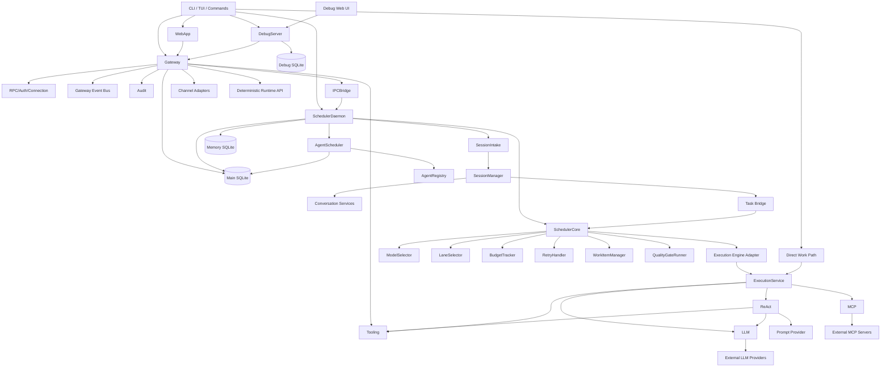
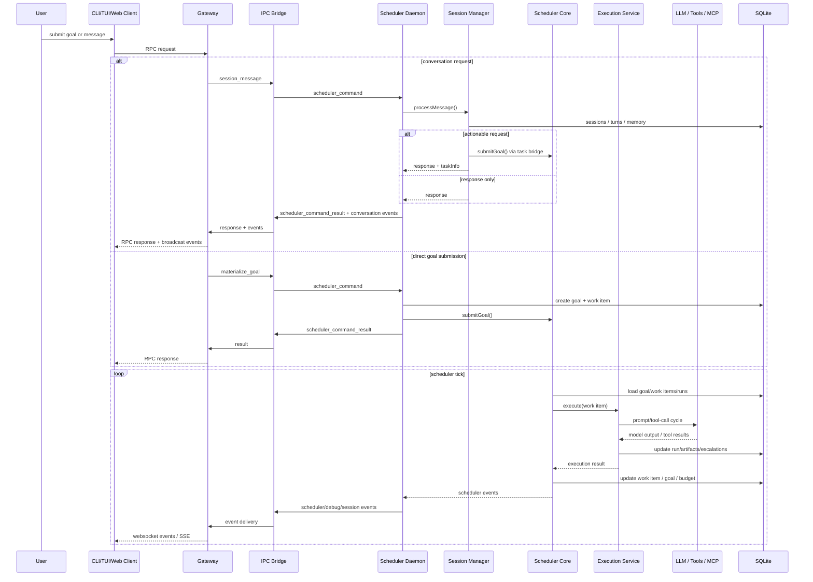

# PonyBunny Architecture Discovery

Analysis date: 2026-03-08

Scope: source under `src/`, `web/`, and `debug-server/`. This document reconstructs the runtime architecture as implemented today, including parallel legacy and auxiliary runtime paths.

## 1. Project Overview

PonyBunny is a local-first autonomous agent runtime that combines a CLI/TUI, a WebSocket gateway, a separate scheduler daemon, SQLite persistence, configurable LLM routing, MCP tool integration, and optional web/debug user interfaces.

### Main purpose

- Accept work as goals, work items, or conversational requests.
- Execute that work through agent-style runs using LLMs, local tools, and MCP tools.
- Persist long-running task state locally.
- Broadcast runtime state to operator interfaces.

### System type

- Primary type: local-first agent orchestration platform.
- User-facing surfaces:
  - CLI and Ink TUI
  - WebSocket control-plane server
  - Scheduler daemon
  - Next.js web UI
  - Debug TUI and debug web server/UI

### Primary runtime components

- `pb` CLI/TUI shell
- Gateway process: WebSocket RPC/auth/event hub
- Scheduler daemon: orchestration, execution, session intake, cron-like agent dispatch
- Main SQLite database: goals/runs/artifacts/audit/permissions/cron state
- Memory SQLite database: conversation sessions, turns, embeddings, core memories
- LLM provider manager: model/endpoint selection and provider protocol adaptation
- Tool layer: local filesystem/shell/search/web tools plus MCP-exposed tools
- Web UI and debug UI layers

### Major technologies

- TypeScript, Node.js, ESM
- `commander` for CLI
- `ink` + React for terminal UIs
- `ws` for Gateway and debug WebSocket transport
- `better-sqlite3` for local persistence
- Next.js 16 + React 19 for `web/` and `debug-server/webui/`
- `@modelcontextprotocol/sdk` for MCP
- `ajv` for config/schema validation

### Important architectural reality

The repository contains three distinct execution styles at the same time:

- Current distributed runtime: `pb` -> Gateway process -> Scheduler daemon
- Direct single-process execution path: `pb work ...`
- Legacy monolithic runtime: `npm start` / `src/main.ts`

That coexistence is central to understanding the current architecture.

## 2. Runtime Entry Points

| Entry point | File path | Responsibility | Initializes |
| --- | --- | --- | --- |
| Main CLI binary | `src/cli/index.ts` | Defines `pb`, top-level commands, and default TUI action | Commander program, command modules, `startTui()` |
| Default operator TUI | `src/cli/tui/start.ts` | Launches the interactive Ink terminal app | `App` from `src/cli/tui/` |
| Gateway service start | `src/cli/commands/gateway.ts` | Starts/stops Gateway in foreground, background, or daemon-supervised mode | SQLite DB handles, memory DB handle, `WorkOrderDatabase`, `GatewayServer`, PID/log management |
| Scheduler service start | `src/cli/commands/scheduler-daemon.ts` | Starts/stops Scheduler daemon in foreground or background | `WorkOrderDatabase`, memory DB, LLM service/router, skill registry, `ExecutionService`, `SchedulerDaemon` |
| Unified service manager | `src/cli/commands/service.ts` | Convenience wrapper for starting/stopping gateway and scheduler together | Delegates to `pb gateway ...` and `pb scheduler ...` |
| Direct work execution | `src/cli/commands/work.ts` | One-shot local execution path that bypasses gateway and scheduler daemon | `WorkOrderDatabase`, LLM service/mock provider, `ExecutionService` |
| Debug TUI | `src/cli/debug-tui/index.ts` | Launches terminal observability UI against Gateway | Ink `DebugApp` |
| Debug command surface | `src/cli/commands/debug.ts` | Starts debug TUI, starts/stops background debug server, or launches foreground debug web flow | Admin pairing token management, background process spawning, `startDebugTui()`, external debug server package |
| Debug server process | `debug-server/server/src/index.ts` | Standalone observability server entry | `DebugServer` |
| Debug server runtime | `debug-server/server/src/debug-server.ts` | Connects to Gateway, ingests debug events, serves debug API/UI | `SQLiteDebugStore`, `GatewayClient`, `TokenManager`, `EventCollector`, `APIServer` |
| Main web application | `web/package.json` | Starts Next.js web UI via `next dev/build/start` | Next.js app under `web/src/app`, server-side `GatewayConnection`, API routes |
| Debug web UI | `debug-server/webui/package.json` | Starts separate Next.js debug web UI | Next.js app under `debug-server/webui/src/app` |
| Legacy monolithic runtime | `src/main.ts` | Older single-process runtime started by `npm start` | Skill registry, `WorkOrderDatabase`, LLM service, `PlanningService`, `ExecutionService`, `VerificationService`, `EvaluationService`, `GoalHarness`, `HarnessDaemon` |
| Legacy browser debug proxy | `src/cli/debug-webui/index.ts` | Older lightweight debug web proxy path still present in repo | `DebugWebServer` from `src/cli/debug-webui/server.ts` |

### Practical startup patterns

- Normal service mode:
  - `pb service start all`
  - launches Gateway and Scheduler as separate processes
- Direct operator mode:
  - `pb`
  - connects TUI to running Gateway
- Direct ad hoc execution:
  - `pb work "..."`
  - runs `ExecutionService` locally without Gateway/Scheduler
- Legacy standalone mode:
  - `npm start`
  - runs `src/main.ts` with `HarnessDaemon` + `GoalHarness`

## 3. Module Inventory

| Module | Location | Purpose | Key files | Public API | Depends on |
| --- | --- | --- | --- | --- | --- |
| CLI/TUI shell | `src/cli/` | User entry surface for service control, interactive work, status, skills, MCP, debug, results | `src/cli/index.ts`, `src/cli/commands/*.ts`, `src/cli/tui/start.ts` | `pb` commands, `startTui()` | Gateway client, service lifecycle commands, runtime config |
| Gateway control plane | `src/gateway/` | Central WebSocket server handling auth, RPC, event fanout, channel routing, IPC bridge, audit, tool exposure | `src/gateway/gateway-server.ts`, `src/gateway/index.ts` | `GatewayServer.start()`, `stop()`, `restartServer()`, exported gateway types/errors | Persistence, auth, event bus, IPC, scheduler bridge, audit, tool registry |
| Gateway RPC/auth/connection layer | `src/gateway/auth/`, `src/gateway/connection/`, `src/gateway/rpc/`, `src/gateway/protocol/` | Session auth, request parsing, permission enforcement, RPC dispatch | `auth-manager.ts`, `connection-manager.ts`, `rpc-handler.ts`, `message-router.ts`, `handlers/*.ts` | RPC method registration and dispatch, auth challenge/pair/verify flow | SQLite pairing tokens, sessions, event bus |
| IPC bridge | `src/ipc/`, `src/gateway/integration/ipc-bridge.ts` | Connects Gateway and Scheduler daemon over a Unix domain socket using line-delimited JSON messages | `ipc-server.ts`, `ipc-client.ts`, `ipc-bridge.ts` | `IPCServer.start()/stop()`, `IPCClient.connect()/send()`, `IPCBridge.sendSchedulerCommand(...)` | Gateway event bus, Scheduler daemon, runtime socket path |
| Scheduler daemon runtime | `src/scheduler-daemon/` | Separate process hosting scheduler core, session intake, agent scheduler loop, retention loop, IPC command handling | `daemon.ts`, `session-intake.ts`, `agent-scheduler.ts`, `pid-lock.ts` | `SchedulerDaemon.start()`, `stop()` | Scheduler core, execution service, repository, IPC client, agent registry, memory DB |
| Scheduler core orchestration | `src/scheduler/` | Tick-based orchestration of goals/work items, model/lane selection, retries, budgets, verification | `core/scheduler.ts`, `model-selector/*`, `lane-selector/*`, `budget-tracker/*`, `retry-handler/*`, `quality-gate-runner/*`, `work-item-manager/*` | `SchedulerCore.start()/pause()/resume()/stop()/submitGoal()/cancelGoal()` | Repository adapter, execution engine adapter, quality gate runner, retry/budget/lane selectors |
| Execution engine | `src/app/lifecycle/execution/`, `src/autonomy/react-integration.ts` | Executes a work item using prompts, tool calls, LLMs, local tools, MCP tools, and policy checks | `execution-service.ts`, `react-integration.ts` | `ExecutionService.executeWorkItem()`, `initializeSkills()`, `initializeMCP()` | Repository, tool registry, prompt provider, LLM provider manager, MCP integration |
| Conversation/session subsystem | `src/app/conversation/`, `src/domain/conversation/`, `src/scheduler-daemon/session-intake.ts` | Conversation state machine, persona-aware response generation, task creation from chat, memory recall, session persistence | `session-manager.ts`, `response-generator.ts`, `persona-engine.ts`, `task-bridge.ts`, `session-intake.ts` | `SessionManager.processMessage()`, `createSession()`, `listSessions()`, `archiveSession()` | Memory DB repos, LLM service, persona repo, scheduler task bridge |
| Agent registry and recurring scheduling | `src/infra/agents/`, `src/infra/scheduler/`, `src/scheduler-daemon/agent-scheduler.ts` | Loads agent definitions from disk, reconciles durable schedules, dispatches cron/interval-triggered agent goals | `agent-registry.ts`, `cron-job-reconciler.ts`, `agent-scheduler.ts` | `getGlobalAgentRegistry()`, `reconcileCronJobsFromRegistry()`, `AgentScheduler.dispatchOnce()` | Repository cron tables, scheduler core, filesystem agent configs |
| Persistence and repository layer | `src/infra/persistence/`, `src/work-order/` | Main and memory SQLite persistence plus repository abstractions and schema bootstrap | `work-order-repository.ts`, `repository-interface.ts`, `schema.sql`, `schema-memory.sql`, `sqlite-session-repository.ts`, `sqlite-memory-repository.ts` | `IWorkOrderRepository`, `WorkOrderDatabase`, session/memory repositories | `better-sqlite3`, domain/work-order types |
| LLM provider management | `src/infra/llm/` | Loads endpoint/model config, resolves workload->model chains, adapts provider protocols, tracks endpoint availability | `provider-manager/provider-manager.ts`, `endpoint-manager.ts`, `protocols/*`, `llm-service.ts` | `LLMProviderManager.complete()`, `completeWithModel()`, `getModelForWorkload()` | `credentials.json`, `llm-config.json`, provider protocols, gateway event bus |
| Tooling and MCP integration | `src/infra/tools/`, `src/infra/mcp/` | Registers built-in tools, enforces allowlists/policies, discovers MCP tools/resources/prompts, adapts remote tools into local tool registry | `tool-registry.ts`, `tool-provider.ts`, `registry-integration.ts`, `client/connection-manager.ts`, `client/mcp-client.ts` | `ToolRegistry`, `ToolEnforcer`, `initializeMCPIntegration()`, `MCPConnectionManager.callTool()` | Runtime config, MCP config, child processes/HTTP transports, execution service |
| Deterministic runtime/internal API | `src/deterministic-runtime/`, `src/gateway/rpc/handlers/internal-runtime-handlers.ts` | Internal plan compilation, run event storage, replay/timeline/dry-run endpoints, runtime rollout diagnostics | `plan-compiler.ts`, `run-events.ts`, `internal-api.ts`, `internal-runtime-handlers.ts` | `PlanCompiler`, run-event stores, `internal.*` RPC methods | Tool registry, repository `run_events`, gateway RPC |
| Observability and audit | `src/debug/`, `src/gateway/debug-broadcaster.ts`, `src/infra/audit/`, `debug-server/server/` | Debug event emission, gateway debug broadcast, audit logging, standalone debug store and replay API | `debug.ts`, `emitter.ts`, `audit-service.ts`, `audit-repository.ts`, `debug-server/server/src/*` | `debug.*` helpers, `AuditService`, `DebugServer` | Gateway, scheduler, SQLite main DB, separate debug DB |
| Web applications | `web/`, `debug-server/webui/` | Browser UIs for operators and observability consumers | `web/src/app/*`, `web/src/lib/server/gateway-connection.ts`, `debug-server/webui/src/app/*` | Next.js routes/pages/components; server-side Gateway proxy and SSE | Gateway or Debug Server HTTP/WebSocket endpoints |

## 4. Dependency Graph

### Human-readable dependency summary

- The CLI layer is the top-level launcher. It either starts long-lived services, opens operator UIs, or runs direct one-shot execution.
- The Gateway is the control-plane hub. It depends on persistence, auth/session management, RPC handlers, audit, channel adapters, the tool registry, and the IPC bridge to the scheduler daemon.
- The Scheduler daemon hosts the active execution plane. It depends on the scheduler core, execution service, repository, memory DB-backed session intake, agent registry, and the IPC client.
- The scheduler core is an orchestrator, not an executor. It depends on adapters for repository access, execution, retry, budget tracking, quality gates, work-item state, and escalation checks.
- The execution service depends on ReAct integration, prompt generation, tool policy enforcement, built-in tools, skills, MCP tools, and the LLM provider manager.
- Conversation/session processing lives in the scheduler process, not in the Gateway. The Gateway forwards conversation RPCs over IPC to `SchedulerSessionIntake`, which in turn uses `SessionManager`.
- The LLM and MCP subsystems are infrastructure dependencies used mostly by execution and conversation response generation.
- The debug server is a separate consumer process that connects back into the Gateway and stores debug events in its own SQLite database.



## 5. Runtime Execution Flow

### 5.1 Service startup flow

1. `pb service start all` delegates to `pb gateway start` and `pb scheduler start`.
2. Gateway process starts:
   - opens main SQLite and memory SQLite handles
   - constructs `WorkOrderDatabase`
   - constructs `GatewayServer`
   - starts WebSocket listener
   - starts Gateway IPC server on the configured Unix socket
   - enables event broadcast, RPC handlers, audit, and optional debug broadcaster
3. Scheduler daemon starts:
   - opens main SQLite repository and memory SQLite DB
   - initializes LLM provider service or mock provider
   - loads skills and MCP tools
   - constructs `ExecutionService`
   - constructs `SchedulerDaemon`
   - connects to Gateway IPC socket
   - constructs `SchedulerCore`
   - constructs `SchedulerSessionIntake`
   - optionally loads agents, reconciles cron jobs, and starts recurring dispatch loop

### 5.2 Goal/task creation flow

There are three active creation paths:

1. Gateway-mediated goal submission:
   - TUI/web client sends `goal.submit`
   - Gateway RPC handler forwards `materialize_goal` to scheduler daemon over IPC
   - Scheduler daemon creates a goal and initial work item in SQLite
   - Scheduler daemon optionally submits the goal into `SchedulerCore`
2. Conversation-created goal:
   - client sends `conversation.message`
   - Gateway forwards to scheduler via IPC
   - `SessionManager` analyzes intent and may call `SchedulerTaskBridge.createGoalFromConversation()`
   - that creates a goal and initial work item, then submits it to `SchedulerCore`
3. Direct single-process path:
   - `pb work "..."` creates goal/work item locally
   - executes the work item immediately via `ExecutionService`
   - bypasses Gateway and `SchedulerCore`

### 5.3 Scheduler execution flow

1. `SchedulerCore.submitGoal()` adds goal ID to in-memory active set.
2. Tick loop (`setInterval`) calls `tick()` every configured interval.
3. For each active goal, `processGoal()`:
   - loads goal from repository
   - checks blocking escalations
   - checks budget state
   - checks if all work items are complete
   - asks `WorkItemManager` for the next ready work item
4. `startWorkItemExecution()`:
   - selects model
   - selects lane
   - creates a `run`
   - updates work item status to `in_progress`
   - emits scheduler events
   - launches async execution without blocking the tick loop
5. `ExecutionService.executeWorkItem()`:
   - normalizes route/tool context
   - applies tool policy and approval gates
   - initializes a run record
   - runs `ReActIntegration.executeWorkCycle()`
6. `ReActIntegration`:
   - builds execution prompt
   - asks the LLM for tool-capable responses
   - executes tool calls through `ToolProvider` / `ToolEnforcer`
   - may invoke local tools or MCP tools
   - accumulates log, token, and cost metadata
7. Back in `SchedulerCore`:
   - run completion is recorded
   - `QualityGateRunner` performs verification
   - success moves work item to `done`
   - recoverable failure requeues or escalates
   - unrecoverable failure marks the goal blocked/failed
8. When all work items are `done`, goal status is set to `completed`.

### 5.4 Event delivery flow

1. Scheduler daemon emits scheduler/debug/session events.
2. Scheduler daemon forwards them over IPC to Gateway.
3. `IPCBridge` converts them into Gateway event-bus events.
4. `BroadcastManager` and debug broadcaster fan out events to subscribed WebSocket sessions.
5. The web UI can also consume a server-side SSE stream backed by a singleton Gateway connection.
6. The standalone debug server separately subscribes to Gateway and persists debug events in its own DB.



## 6. Storage Architecture

| Storage system | Location | Purpose | Data stored | Accessed by |
| --- | --- | --- | --- | --- |
| Main SQLite DB | Configured by `runtimeConfig.paths.database`, default `~/.ponybunny/pony.db` | Durable task/control-plane persistence | `goals`, `work_items`, `runs`, `run_events`, `artifacts`, `decisions`, `escalations`, `context_packs`, `pairing_tokens`, `audit_logs`, `permission_requests`, `permission_grants`, `cron_jobs`, `cron_job_runs`, `meta` | Gateway, Scheduler daemon, direct `pb work`, legacy `src/main.ts` |
| Memory SQLite DB | Configured by `runtimeConfig.memory.database`, default `~/.ponybunny/memory.db` | Conversation/session and memory persistence | `sessions`, `session_turns`, `memory_entries`, `embedding_cache`, `core_memories`, FTS virtual tables and triggers | Scheduler daemon session intake, conversation subsystem |
| Debug SQLite DB | Passed to debug server, often `./debug.db` or `~/.ponybunny/debug.db` | Persisted debug telemetry and replay state | `events`, goal/work item/run caches, `metrics`, `snapshots`, `timeline_metadata` | `debug-server/server` |
| JSON runtime config | `~/.config/ponybunny/ponybunny.json` | Main runtime settings | gateway host/port, socket path, scheduler flags, agent settings, memory settings, debug settings, TUI settings | CLI commands, Gateway, Scheduler daemon, web/status surfaces |
| Credentials config | `~/.config/ponybunny/credentials.json` | Secrets and provider credentials | API keys, endpoint auth data | LLM provider layer, auth commands, config UI |
| LLM config | `~/.config/ponybunny/llm-config.json` | Endpoint and model routing | providers, models, workloads, defaults, fallbacks | LLM provider manager, models CLI |
| MCP config | `~/.config/ponybunny/mcp-config.json` | External MCP server definitions | enabled MCP servers, transport config, env/headers | MCP connection manager, MCP CLI |
| Gateway local JSON stores | `~/.config/ponybunny/gateway/*.json` | Control-plane local state not stored in SQLite | channel adapter configs, channel session overrides, recent channel events | Gateway server |
| PID/log files | `~/.ponybunny/*.pid`, `~/.ponybunny/*.log` | Process supervision and operational logs | gateway/scheduler/debug-server PIDs, stdout/stderr logs | CLI service/debug/gateway/scheduler commands |
| Vault files | `~/.config/ponybunny/vault/*.pbvault` | Encrypted credential backups | AES-GCM encrypted `credentials.json` snapshots | `pb auth` vault operations |
| Agent/persona/skill files | workspace `agents/`, config `~/.config/ponybunny/personas`, `skills` dirs | Externalized runtime definitions | agent configs/markdown, persona files, skill descriptors | Agent registry, persona repository, skill loader |

### Main DB schema highlights

- Work management:
  - `goals`
  - `work_items`
  - `runs`
  - `artifacts`
  - `decisions`
  - `escalations`
  - `context_packs`
- Runtime/audit/control:
  - `run_events`
  - `pairing_tokens`
  - `audit_logs`
  - `permission_requests`
  - `permission_grants`
  - `meta`
- Recurring scheduling:
  - `cron_jobs`
  - `cron_job_runs`

### Memory DB schema highlights

- Session state:
  - `sessions`
  - `session_turns`
- Semantic/keyword memory:
  - `memory_entries`
  - `memory_entries_fts`
  - `embedding_cache`
- Long-lived summaries:
  - `core_memories`
  - `core_memories_fts`

## 7. Task Lifecycle

### 7.1 Goal lifecycle

Defined goal states:

```text
queued -> active -> completed
queued -> cancelled
active -> blocked
active -> cancelled
blocked -> active
blocked -> cancelled
```

Current runtime movement:

1. Goals are usually created in `queued`.
2. `SchedulerCore.submitGoal()` makes them active in the scheduler’s in-memory state.
3. Repository status changes to `completed`, `blocked`, or `cancelled` based on execution outcome.
4. Cron-dispatched agent work also enters through goal creation plus immediate submission.

### 7.2 Work item lifecycle

Defined work-item states:

```text
queued -> ready -> in_progress -> verify -> done
in_progress -> failed
failed -> queued or ready
queued/ready/in_progress/failed -> blocked
blocked -> ready
```

Current movement in the distributed runtime:

1. Goal creation usually materializes one initial work item.
2. `WorkItemManager` moves `queued` items to `ready` once dependencies are satisfied.
3. `SchedulerCore` moves `ready` -> `in_progress`.
4. Successful execution moves `in_progress` -> `verify`.
5. `QualityGateRunner` decides:
   - `verify` -> `done`
   - `verify` -> failure path
6. Retry logic either:
   - requeues the work item
   - blocks it with an escalation
   - marks it failed terminally

### 7.3 Run lifecycle

Run states:

```text
running -> success | failure | timeout | aborted
```

Runs are created just before execution and completed after `ExecutionService` returns. Their metadata carries selected model, actual model, endpoint ID, usage, artifacts, and execution logs.

### 7.4 Escalation and approval lifecycle

- Escalations are created for:
  - human approval requirements
  - ambiguous selection/resource narrowing
  - credential/auth errors
  - budget exceeded conditions
  - execution failures escalated by retry policy
- Permission requests/grants are stored separately for tool approval workflows.
- Goal processing pauses when blocking escalations exist.

### 7.5 Conversation lifecycle

Conversation sessions have separate lifecycle state:

- `active`
- `archived`

Conversation state machines also track conversational states like idle/clarifying/responding/task-oriented, but these are separate from the work-order lifecycle.

## 8. Concurrency Model

### Process model

- Multiple Node.js processes:
  - Gateway process
  - Scheduler daemon process
  - optional debug server process
  - optional Next.js web process
  - optional Next.js debug web UI process
- No worker threads are used in the core runtime.

### In-process concurrency

- Gateway:
  - event-driven WebSocket handling
  - in-memory event bus
  - async RPC handlers
  - IPC server handling multiple socket clients
- Scheduler daemon:
  - `setInterval` tick loop for scheduler core
  - separate interval for agent scheduler dispatch
  - separate interval for run-event retention
  - work-item execution launched asynchronously and tracked in memory
- Debug server:
  - HTTP + WebSocket event loop
  - background cleanup timer

### Practical concurrent execution behavior

- `SchedulerCore` can have multiple active runs at once because it launches execution promises without awaiting them inside the tick loop.
- Lane capacity constrains concurrency by lane (`main`, `subagent`, `cron`, `session`).
- MCP client connections can spawn child processes or maintain long-lived HTTP streams to external servers.
- Tool execution can spawn shell commands.

### Likely bottlenecks

- `better-sqlite3` is synchronous, so DB-heavy hot paths can block the event loop in each process.
- Gateway is a single process concentrating auth, RPC, IPC, channel routing, audit, config watching, and debug broadcast.
- Scheduler daemon is also single-process and multiplexes orchestration, conversation intake, cron dispatch, and execution startup.
- The web app’s server-side singleton Gateway connection is process-local and not naturally multi-instance aware.

## 9. Observability

### Built-in runtime signals

- Structured Gateway event bus events
- Debug events via `src/debug/`
- Audit logs in `audit_logs`
- Run-level deterministic events in `run_events`
- CLI-managed log files:
  - `~/.ponybunny/gateway.log`
  - `~/.ponybunny/scheduler.log`
  - `~/.ponybunny/debug-server.log`

### Debug instrumentation

- `debugEmitter` is a global in-process debug event source.
- `setupDebugBroadcaster()` forwards debug events from Gateway to subscribed admin sessions.
- Scheduler daemon can also forward debug events over IPC to Gateway.
- The standalone debug server ingests those events and stores them in a dedicated debug database.

### Debug server capabilities

- Live event ingestion from Gateway
- Event filtering and metrics aggregation
- Entity caches for goals/work items/runs
- Snapshot creation for replay
- Replay/timeline APIs
- HTTP API plus WebSocket streaming for debug UIs

### Operator UIs

- Main web app:
  - uses Next.js API routes and SSE
  - talks to Gateway through a server-side singleton WebSocket connection
- Debug web UI:
  - talks to standalone debug server over HTTP/WebSocket
- Debug TUI:
  - connects directly to Gateway with admin token

## 10. Architecture Risks

### 1. Parallel runtime architectures coexist

- The repository contains a distributed Gateway/Scheduler runtime, a direct `pb work` execution path, and a legacy monolithic `src/main.ts` runtime.
- Planning, verification, and evaluation services are strongly present in the legacy path, while the active distributed path primarily works from already-materialized work items.
- This creates architectural drift between intended lifecycle design and active service wiring.

### 2. Gateway is a very large integration hub

- `GatewayServer` owns WebSocket serving, auth, RPC registration, event bus, audit setup, tool registration, channel adapters, config watching, IPC server startup, runtime rollout telemetry, and debug broadcasting.
- Many unrelated responsibilities converge in one process and one class boundary.

### 3. Scheduler daemon concentrates multiple domains

- The scheduler daemon hosts orchestration, execution bootstrap, session intake, persona/memory services, cron agent dispatch, runtime rollout mutation, and retention tasks.
- This makes runtime behavior highly coupled even though the system is split into two processes.

### 4. State is split between durable tables and ephemeral maps

- Examples include:
  - scheduler active goal state
  - lane active counts
  - IPC pending request maps
  - scheduler-session to gateway-session bindings
  - in-flight cron job tracking maps
- Restarts recover some state from SQLite, but not all in-memory coordination state.

### 5. Tooling is registered in multiple places with global singletons

- Gateway and `ExecutionService` both create tool registries and both set global tool-provider state.
- Skills, prompts, and MCP integration also rely on global registries/singletons.
- Hidden coupling is introduced through process-global state rather than explicit composition only.

### 6. Synchronous SQLite in hot paths can stall the event loop

- Both Gateway and Scheduler use `better-sqlite3`, which is synchronous.
- Under heavier event, session, or execution load, DB activity can directly impact responsiveness of WebSocket, IPC, and scheduler loops.

### 7. IPC is custom and in-memory coordinated

- Gateway/Scheduler coordination uses a custom line-delimited Unix socket protocol with request correlation held in memory.
- There is no durable command queue or replayable transport between the two services.

### 8. Some runtime state lives outside the main repository and outside the main DB

- Agents, skills, personas, config JSON, vault files, logs, PID files, and gateway channel JSON stores all live on disk in different locations.
- Effective runtime behavior depends on external filesystem state, not just repository code and the main SQLite DB.

### 9. Web control-plane access is process-local

- The main Next.js app uses a singleton server-side Gateway connection.
- That is convenient locally, but it tightly couples request handling and event streaming to one app process instance.

### 10. Deterministic runtime support is only partially integrated

- Deterministic planning/replay/dry-run APIs exist and are exposed through Gateway internal RPC methods.
- The main scheduler execution path remains centered on the existing ReAct execution service.
- This leaves two partially overlapping models of execution and diagnostics in the same codebase.

