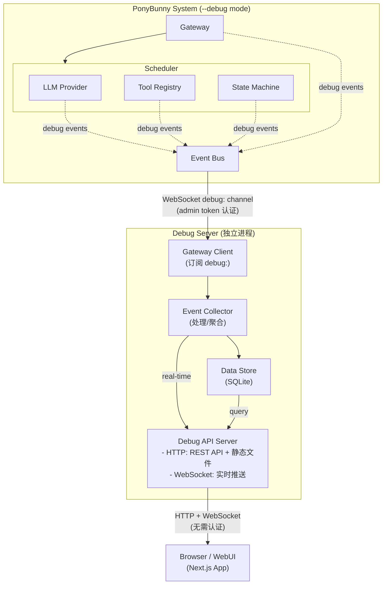
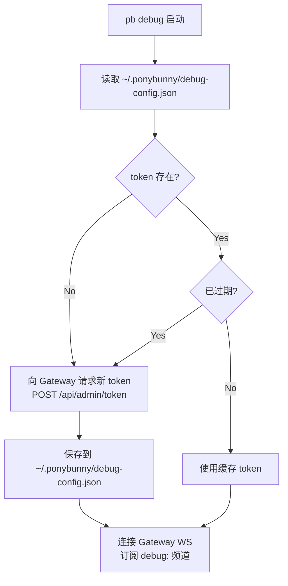
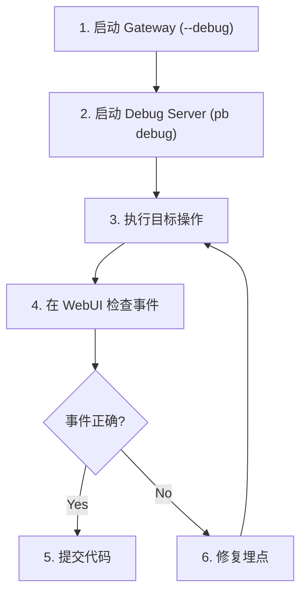

# Debug Server 架构设计

## 1. 概述

Debug Server 是 PonyBunny 系统的可观测性组件，用于收集、存储和展示系统运行时的调试事件。
它作为独立进程运行，监听 Gateway 在 debug 模式下发送的事件，并通过 Web UI 提供实时可视化。

**核心特性：**
- 事件持久化 - 历史事件可查询，系统重启不丢失
- 实时推送 - WebSocket 实时展示系统状态变化
- 工厂模式事件 - 可扩展的事件类型定义，随系统演进而扩展
- 零配置启动 - 单命令启动 Server + WebUI

## 2. 整体架构



## 3. 认证模型

| 连接                        | 认证方式        | 说明                           |
|-----------------------------|-----------------|--------------------------------|
| Debug Server → Gateway      | admin token     | 自动获取，无需人工干预         |
| WebUI → Debug Server        | 无需认证        | 本地开发调试工具，简化使用     |

### 3.1 自动认证流程

Debug Server 启动时自动处理认证，全程无需人工干预：



### 3.2 Token 配置文件

```typescript
// ~/.ponybunny/debug-config.json
interface DebugConfig {
  gateway: {
    url: string;           // 上次连接的 Gateway URL
    token: string;         // admin token
    tokenExpiresAt: number; // 过期时间戳 (ms)
  };
  lastConnected?: number;  // 上次成功连接时间
}
```

### 3.3 Token 管理器实现

```typescript
// debug-server/server/src/token-manager.ts

import fs from 'fs/promises';
import path from 'path';
import os from 'os';

interface TokenInfo {
  token: string;
  expiresAt: number;
}

export class TokenManager {
  private configPath: string;
  private gatewayUrl: string;

  constructor(gatewayUrl: string) {
    this.configPath = path.join(os.homedir(), '.ponybunny', 'debug-config.json');
    this.gatewayUrl = gatewayUrl;
  }

  // 获取有效 token（自动刷新）
  async getToken(): Promise<string> {
    const cached = await this.loadCachedToken();

    if (cached && cached.expiresAt > Date.now() + 60000) {
      // token 有效且距离过期还有 1 分钟以上
      return cached.token;
    }

    // 需要获取新 token
    const newToken = await this.requestNewToken();
    await this.saveToken(newToken);
    return newToken.token;
  }

  private async loadCachedToken(): Promise<TokenInfo | null> {
    try {
      const content = await fs.readFile(this.configPath, 'utf-8');
      const config = JSON.parse(content);
      if (config.gateway?.token && config.gateway?.tokenExpiresAt) {
        return {
          token: config.gateway.token,
          expiresAt: config.gateway.tokenExpiresAt,
        };
      }
    } catch {
      // 文件不存在或解析失败
    }
    return null;
  }

  private async requestNewToken(): Promise<TokenInfo> {
    // 将 ws:// 转为 http://
    const httpUrl = this.gatewayUrl.replace(/^ws/, 'http');

    const response = await fetch(`${httpUrl}/api/admin/token`, {
      method: 'POST',
      headers: { 'Content-Type': 'application/json' },
      body: JSON.stringify({ client: 'debug-server' }),
    });

    if (!response.ok) {
      throw new Error(`Failed to get admin token: ${response.status}`);
    }

    const data = await response.json();
    return {
      token: data.token,
      expiresAt: data.expiresAt,
    };
  }

  private async saveToken(tokenInfo: TokenInfo): Promise<void> {
    const dir = path.dirname(this.configPath);
    await fs.mkdir(dir, { recursive: true });

    let config: Record<string, unknown> = {};
    try {
      const content = await fs.readFile(this.configPath, 'utf-8');
      config = JSON.parse(content);
    } catch {
      // 使用空配置
    }

    config.gateway = {
      url: this.gatewayUrl,
      token: tokenInfo.token,
      tokenExpiresAt: tokenInfo.expiresAt,
    };
    config.lastConnected = Date.now();

    await fs.writeFile(this.configPath, JSON.stringify(config, null, 2));
  }
}
```

## 4. 核心组件

### 4.1 Gateway Client (数据源连接)

连接到 PonyBunny Gateway，订阅 `debug:` 频道的所有事件。

```typescript
interface IGatewayClient {
  // 连接到 Gateway (使用 admin token)
  connect(gatewayUrl: string, adminToken: string): Promise<void>;
  disconnect(): void;

  // 监听 debug 事件
  onEvent(handler: (event: DebugEvent) => void): void;

  // 连接状态
  isConnected(): boolean;
  onConnectionChange(handler: (connected: boolean) => void): void;
}
```

### 4.2 Event Collector (事件处理器)

处理、转换、聚合事件，使用工厂模式支持事件类型扩展。

```typescript
interface IEventCollector {
  // 接收原始事件
  ingest(event: DebugEvent): void;

  // 注册事件处理器（工厂模式）
  registerHandler(type: string, handler: IEventHandler): void;

  // 聚合计算（定期执行）
  computeMetrics(): AggregatedMetrics;
}

// 事件处理器接口（工厂模式）
interface IEventHandler {
  type: string;
  process(event: DebugEvent): EnrichedEvent;
  aggregate?(events: DebugEvent[]): AggregatedData;
}
```

### 4.3 Data Store (数据存储)

SQLite 持久化层。

```typescript
interface IDebugDataStore {
  // 事件存储
  saveEvent(event: EnrichedEvent): void;
  queryEvents(filter: EventFilter): EnrichedEvent[];

  // 实体缓存（Goal, WorkItem, Run 的最新状态）
  upsertGoal(goal: Goal): void;
  upsertWorkItem(workItem: WorkItem): void;
  upsertRun(run: Run): void;

  getGoal(id: string): Goal | null;
  getGoals(filter?: GoalFilter): Goal[];
  getWorkItems(goalId?: string): WorkItem[];
  getRuns(workItemId?: string): Run[];

  // 聚合数据
  saveMetrics(metrics: AggregatedMetrics): void;
  queryMetrics(timeRange: TimeRange): AggregatedMetrics[];
}
```

### 4.4 Debug API Server (对外服务)

HTTP + WebSocket 服务，无需认证。

```typescript
interface IDebugAPIServer {
  start(port: number): Promise<void>;
  stop(): Promise<void>;
}

// HTTP 端点
// GET  /api/events          - 查询历史事件
// GET  /api/goals           - 查询 goals
// GET  /api/goals/:id       - 单个 goal 详情
// GET  /api/workitems       - 查询 work items
// GET  /api/runs            - 查询 runs
// GET  /api/metrics         - 聚合指标
// GET  /api/health          - 健康检查
// GET  /*                   - 静态文件 (Next.js build)

// WebSocket 端点
// WS   /ws                  - 实时事件推送
//   - 连接后自动推送新事件
//   - 支持订阅特定 goal
//   - 支持过滤事件类型
```

## 5. 事件系统设计（工厂模式）

### 5.1 基础事件类型

```typescript
// 所有事件的基类
interface DebugEvent {
  id: string;
  timestamp: number;
  type: string;           // 事件类型，如 "goal.created", "llm.request"
  source: string;         // 来源模块，如 "scheduler", "gateway", "llm-provider"
  data: Record<string, unknown>;
}

// 处理后的事件（添加上下文）
interface EnrichedEvent extends DebugEvent {
  goalId?: string;
  workItemId?: string;
  runId?: string;
  duration?: number;      // 对于请求/响应类事件
}
```

### 5.2 事件类型注册表

```typescript
// 事件工厂 - 集中管理所有事件类型
class DebugEventFactory {
  private static handlers = new Map<string, IEventHandler>();

  // 注册新的事件处理器
  static register(handler: IEventHandler): void {
    this.handlers.set(handler.type, handler);
  }

  // 处理事件
  static process(event: DebugEvent): EnrichedEvent {
    const handler = this.handlers.get(event.type);
    if (handler) {
      return handler.process(event);
    }
    return event as EnrichedEvent; // 未知类型直接透传
  }
}
```

### 5.3 预定义事件类型

| 类别 | 事件类型 | 触发位置 | 说明 |
|------|----------|----------|------|
| **Goal** | `goal.created` | Scheduler | 新 Goal 创建 |
| | `goal.status_changed` | Scheduler | Goal 状态变化 |
| | `goal.completed` | Scheduler | Goal 完成 |
| **WorkItem** | `workitem.created` | Scheduler | WorkItem 创建 |
| | `workitem.status_changed` | Scheduler | 状态变化 |
| | `workitem.assigned` | Scheduler | 分配到 Lane |
| **Run** | `run.started` | Scheduler/Agent | Run 开始执行 |
| | `run.completed` | Scheduler/Agent | Run 完成 |
| | `run.failed` | Scheduler/Agent | Run 失败 |
| **LLM** | `llm.request` | LLM Provider | LLM 请求发起 |
| | `llm.response` | LLM Provider | LLM 响应返回 |
| | `llm.error` | LLM Provider | LLM 调用失败 |
| | `llm.tokens` | LLM Provider | Token 消耗统计 |
| **Tool** | `tool.invoke` | Tool Registry | 工具调用开始 |
| | `tool.result` | Tool Registry | 工具返回结果 |
| | `tool.error` | Tool Registry | 工具执行失败 |
| **State** | `state.transition` | State Machine | 状态机转换 |
| **System** | `system.startup` | Gateway | 系统启动 |
| | `system.shutdown` | Gateway | 系统关闭 |
| | `system.error` | Any | 系统级错误 |

### 5.4 扩展新事件类型

```typescript
// 添加新的事件类型只需实现 IEventHandler
class MyCustomEventHandler implements IEventHandler {
  type = 'custom.my_event';

  process(event: DebugEvent): EnrichedEvent {
    // 自定义处理逻辑
    return {
      ...event,
      // 添加额外字段
    };
  }
}

// 注册
DebugEventFactory.register(new MyCustomEventHandler());
```

## 6. 数据模型

### 6.1 SQLite Schema (debug.db)

```sql
-- 事件表（核心）
CREATE TABLE events (
  id TEXT PRIMARY KEY,
  timestamp INTEGER NOT NULL,
  type TEXT NOT NULL,
  source TEXT NOT NULL,
  goal_id TEXT,
  work_item_id TEXT,
  run_id TEXT,
  data JSON NOT NULL,
  created_at INTEGER DEFAULT (unixepoch() * 1000)
);
CREATE INDEX idx_events_timestamp ON events(timestamp DESC);
CREATE INDEX idx_events_type ON events(type);
CREATE INDEX idx_events_goal_id ON events(goal_id);

-- Goals 缓存（最新状态）
CREATE TABLE goals (
  id TEXT PRIMARY KEY,
  status TEXT NOT NULL,
  title TEXT,
  data JSON NOT NULL,
  updated_at INTEGER NOT NULL
);

-- WorkItems 缓存
CREATE TABLE work_items (
  id TEXT PRIMARY KEY,
  goal_id TEXT NOT NULL,
  status TEXT NOT NULL,
  title TEXT,
  data JSON NOT NULL,
  updated_at INTEGER NOT NULL
);
CREATE INDEX idx_work_items_goal ON work_items(goal_id);

-- Runs 缓存
CREATE TABLE runs (
  id TEXT PRIMARY KEY,
  work_item_id TEXT NOT NULL,
  status TEXT NOT NULL,
  data JSON NOT NULL,
  updated_at INTEGER NOT NULL
);
CREATE INDEX idx_runs_work_item ON runs(work_item_id);

-- 聚合指标（按时间窗口）
CREATE TABLE metrics (
  id INTEGER PRIMARY KEY AUTOINCREMENT,
  window_start INTEGER NOT NULL,
  window_end INTEGER NOT NULL,
  data JSON NOT NULL
);
CREATE INDEX idx_metrics_window ON metrics(window_start, window_end);
```

## 7. 配置

```typescript
interface DebugServerConfig {
  // Gateway 连接
  gateway: {
    url: string;           // ws://127.0.0.1:18789
    adminToken: string;    // admin token
    reconnect: boolean;    // 自动重连，默认 true
  };

  // 存储配置
  storage: {
    dbPath: string;        // SQLite 路径，默认 ~/.ponybunny/debug.db
    retention?: {
      eventsDays: number;  // 事件保留天数，默认 7
    };
  };

  // API 服务
  server: {
    port: number;          // 默认 18790
    host: string;          // 默认 127.0.0.1
  };

  // 聚合配置
  aggregation: {
    metricsWindow: number; // 指标窗口 ms，默认 300000 (5min)
  };
}
```

## 8. CLI 命令

```bash
# 启动 Debug Server + 打开 WebUI
pb debug [options]
  --gateway-url <url>     Gateway WebSocket URL (default: ws://127.0.0.1:18789)
  --port <port>           Debug Server port (default: 18790)
  --db <path>             SQLite database path (default: ~/.ponybunny/debug.db)
  --no-open               Don't open browser automatically

# 示例
pb debug                                    # 默认配置启动
pb debug --port 3000                        # 指定端口
pb debug --gateway-url ws://192.168.1.100:18789  # 连接远程 Gateway
```

**启动流程：**
1. 启动 Debug Server
2. 读取 `~/.ponybunny/debug-config.json` 检查缓存 token
3. 若 token 不存在或已过期，自动向 Gateway 请求新 token
4. 保存 token 到配置文件
5. 使用 token 连接 Gateway WebSocket，订阅 `debug:` 频道
6. 初始化 SQLite 数据库
7. 启动 HTTP 服务（提供 API + 静态文件）
8. 自动打开浏览器访问 http://127.0.0.1:18790

全程无需人工干预。

## 9. 目录结构

```
debug-server/                    # Debug 子系统（独立目录）
├── server/                      # Debug Server 后端
│   ├── src/
│   │   ├── index.ts            # 入口
│   │   ├── debug-server.ts     # 主服务类
│   │   ├── gateway-client.ts   # Gateway 连接管理
│   │   ├── event-collector.ts  # 事件收集/处理
│   │   ├── api-server.ts       # HTTP + WebSocket API
│   │   ├── store/
│   │   │   ├── index.ts
│   │   │   ├── types.ts        # IDebugDataStore 接口
│   │   │   ├── sqlite-store.ts # SQLite 实现
│   │   │   └── schema.sql      # SQLite schema
│   │   ├── events/
│   │   │   ├── index.ts
│   │   │   ├── factory.ts      # DebugEventFactory
│   │   │   ├── types.ts        # 事件类型定义
│   │   │   └── handlers/       # 各类事件处理器
│   │   │       ├── goal-events.ts
│   │   │       ├── workitem-events.ts
│   │   │       ├── run-events.ts
│   │   │       ├── llm-events.ts
│   │   │       └── tool-events.ts
│   │   └── types.ts            # Debug Server 类型定义
│   ├── package.json
│   └── tsconfig.json
│
└── webui/                       # Next.js Web UI
    ├── src/
    │   ├── app/
    │   │   ├── page.tsx        # 首页 (Overview Dashboard)
    │   │   ├── goals/
    │   │   │   └── page.tsx    # Goals 列表
    │   │   ├── goals/[id]/
    │   │   │   └── page.tsx    # Goal 详情
    │   │   ├── events/
    │   │   │   └── page.tsx    # Events 时间线
    │   │   └── metrics/
    │   │       └── page.tsx    # Metrics 图表
    │   ├── components/
    │   │   ├── layout/
    │   │   ├── goal-card.tsx
    │   │   ├── event-list.tsx
    │   │   ├── workitem-tree.tsx
    │   │   └── ...
    │   └── lib/
    │       ├── api-client.ts   # Debug Server REST API 客户端
    │       └── websocket.ts    # WebSocket 实时连接
    ├── package.json
    ├── next.config.js
    └── tsconfig.json

src/
├── cli/
│   └── commands/
│       └── debug.ts            # pb debug 命令实现
```

## 10. Gateway Debug 模式

Gateway 通过 `--debug` 参数启动 debug 模式：

```bash
# 启动 Gateway（debug 模式）
node dist/main.js --debug

# 或通过环境变量
PONY_DEBUG=true node dist/main.js
```

**Debug 模式行为：**
1. 启用事件埋点收集
2. 通过 `debug:` WebSocket 频道广播事件
3. 无论是否有 Debug Server 连接，事件都会发送

**埋点位置：**
- Gateway: 连接事件、消息路由
- Scheduler: Goal/WorkItem/Run 生命周期
- LLM Provider: 请求/响应/Token 统计
- Tool Registry: 工具调用
- State Machine: 状态转换

## 11. 埋点实现

埋点 API 提供统一的事件发送接口，各模块可直接使用。埋点代码位于 `src/debug/` 目录，是 PonyBunny 主系统的一部分。

### 11.1 核心埋点 API

```typescript
// src/debug/index.ts - 导出

export { DebugEmitter } from './emitter.js';
export { debug } from './debug.js';
export type { DebugEvent, DebugContext } from './types.js';
```

```typescript
// src/debug/types.ts - 类型定义

export interface DebugEvent {
  id: string;
  timestamp: number;
  type: string;
  source: string;
  data: Record<string, unknown>;
  // 可选的上下文关联
  goalId?: string;
  workItemId?: string;
  runId?: string;
}

export interface DebugContext {
  goalId?: string;
  workItemId?: string;
  runId?: string;
}
```

```typescript
// src/debug/emitter.ts - 事件发射器

import { EventEmitter } from 'events';
import { randomUUID } from 'crypto';
import type { DebugEvent, DebugContext } from './types.js';

class DebugEmitter extends EventEmitter {
  private enabled = false;
  private context: DebugContext = {};

  // 启用/禁用 debug 模式
  enable(): void {
    this.enabled = true;
  }

  disable(): void {
    this.enabled = false;
  }

  isEnabled(): boolean {
    return this.enabled;
  }

  // 设置当前上下文（在处理 Goal/WorkItem/Run 时设置）
  setContext(ctx: DebugContext): void {
    this.context = { ...this.context, ...ctx };
  }

  clearContext(): void {
    this.context = {};
  }

  // 发送 debug 事件
  emit(type: string, source: string, data: Record<string, unknown>): boolean {
    if (!this.enabled) {
      return false;
    }

    const event: DebugEvent = {
      id: randomUUID(),
      timestamp: Date.now(),
      type,
      source,
      data,
      ...this.context,
    };

    return super.emit('debug', event);
  }
}

// 单例
export const debugEmitter = new DebugEmitter();
```

```typescript
// src/debug/debug.ts - 便捷 API

import { debugEmitter } from './emitter.js';
import type { DebugContext } from './types.js';

// 便捷发送方法
export const debug = {
  // 检查是否启用
  get enabled() {
    return debugEmitter.isEnabled();
  },

  // 设置上下文
  setContext(ctx: DebugContext) {
    debugEmitter.setContext(ctx);
  },

  clearContext() {
    debugEmitter.clearContext();
  },

  // ========== Goal 事件 ==========
  goalCreated(goal: { id: string; title: string; [key: string]: unknown }) {
    debugEmitter.emit('goal.created', 'scheduler', { goal });
  },

  goalStatusChanged(goalId: string, from: string, to: string) {
    debugEmitter.emit('goal.status_changed', 'scheduler', { goalId, from, to });
  },

  goalCompleted(goalId: string, result: unknown) {
    debugEmitter.emit('goal.completed', 'scheduler', { goalId, result });
  },

  // ========== WorkItem 事件 ==========
  workItemCreated(workItem: { id: string; goalId: string; [key: string]: unknown }) {
    debugEmitter.emit('workitem.created', 'scheduler', { workItem });
  },

  workItemStatusChanged(workItemId: string, from: string, to: string) {
    debugEmitter.emit('workitem.status_changed', 'scheduler', { workItemId, from, to });
  },

  workItemAssigned(workItemId: string, lane: string) {
    debugEmitter.emit('workitem.assigned', 'scheduler', { workItemId, lane });
  },

  // ========== Run 事件 ==========
  runStarted(run: { id: string; workItemId: string; [key: string]: unknown }) {
    debugEmitter.emit('run.started', 'scheduler', { run });
  },

  runCompleted(runId: string, result: unknown) {
    debugEmitter.emit('run.completed', 'scheduler', { runId, result });
  },

  runFailed(runId: string, error: unknown) {
    debugEmitter.emit('run.failed', 'scheduler', { runId, error });
  },

  // ========== LLM 事件 ==========
  llmRequest(requestId: string, model: string, messages: unknown[], options?: unknown) {
    debugEmitter.emit('llm.request', 'llm-provider', {
      requestId,
      model,
      messageCount: Array.isArray(messages) ? messages.length : 0,
      options,
    });
  },

  llmResponse(requestId: string, model: string, response: unknown, durationMs: number) {
    debugEmitter.emit('llm.response', 'llm-provider', {
      requestId,
      model,
      durationMs,
      response,
    });
  },

  llmError(requestId: string, model: string, error: unknown) {
    debugEmitter.emit('llm.error', 'llm-provider', { requestId, model, error });
  },

  llmTokens(requestId: string, model: string, inputTokens: number, outputTokens: number) {
    debugEmitter.emit('llm.tokens', 'llm-provider', {
      requestId,
      model,
      inputTokens,
      outputTokens,
      totalTokens: inputTokens + outputTokens,
    });
  },

  // ========== Tool 事件 ==========
  toolInvoke(invocationId: string, toolName: string, args: unknown) {
    debugEmitter.emit('tool.invoke', 'tool-registry', { invocationId, toolName, args });
  },

  toolResult(invocationId: string, toolName: string, result: unknown, durationMs: number) {
    debugEmitter.emit('tool.result', 'tool-registry', {
      invocationId,
      toolName,
      result,
      durationMs,
    });
  },

  toolError(invocationId: string, toolName: string, error: unknown) {
    debugEmitter.emit('tool.error', 'tool-registry', { invocationId, toolName, error });
  },

  // ========== State 事件 ==========
  stateTransition(entityType: string, entityId: string, from: string, to: string) {
    debugEmitter.emit('state.transition', 'state-machine', {
      entityType,
      entityId,
      from,
      to,
    });
  },

  // ========== System 事件 ==========
  systemStartup(config: unknown) {
    debugEmitter.emit('system.startup', 'gateway', { config });
  },

  systemShutdown(reason?: string) {
    debugEmitter.emit('system.shutdown', 'gateway', { reason });
  },

  systemError(source: string, error: unknown) {
    debugEmitter.emit('system.error', source, { error });
  },

  // ========== 通用事件 ==========
  custom(type: string, source: string, data: Record<string, unknown>) {
    debugEmitter.emit(type, source, data);
  },
};
```

### 11.2 Gateway 集成

Gateway 在 debug 模式下订阅事件并通过 WebSocket 广播：

```typescript
// src/gateway/debug-broadcaster.ts

import { debugEmitter } from '../debug/emitter.js';
import type { DebugEvent } from '../debug/types.js';
import type { WebSocketServer } from 'ws';

export function setupDebugBroadcaster(wss: WebSocketServer, debugMode: boolean): void {
  if (!debugMode) {
    return;
  }

  // 启用 debug 模式
  debugEmitter.enable();

  // 监听所有 debug 事件并广播
  debugEmitter.on('debug', (event: DebugEvent) => {
    const message = JSON.stringify({
      channel: 'debug',
      event,
    });

    // 向所有已认证的 admin 连接广播
    wss.clients.forEach((client) => {
      if (client.readyState === 1 && (client as any).isAdmin) {
        client.send(message);
      }
    });
  });
}
```

### 11.3 使用示例

各模块可直接导入 `debug` 使用：

```typescript
// src/scheduler/goal-processor.ts

import { debug } from '../debug/index.js';

export class GoalProcessor {
  async createGoal(input: CreateGoalInput): Promise<Goal> {
    const goal = await this.repository.create(input);

    // 埋点：Goal 创建
    debug.goalCreated(goal);

    return goal;
  }

  async updateGoalStatus(goalId: string, newStatus: GoalStatus): Promise<void> {
    const goal = await this.repository.get(goalId);
    const oldStatus = goal.status;

    await this.repository.updateStatus(goalId, newStatus);

    // 埋点：状态变化
    debug.goalStatusChanged(goalId, oldStatus, newStatus);

    if (newStatus === 'completed') {
      debug.goalCompleted(goalId, goal.result);
    }
  }
}
```

```typescript
// src/infra/llm/llm-provider.ts

import { debug } from '../../debug/index.js';
import { randomUUID } from 'crypto';

export class LLMProvider {
  async chat(model: string, messages: Message[], options?: ChatOptions): Promise<Response> {
    const requestId = randomUUID();
    const startTime = Date.now();

    // 埋点：请求开始
    debug.llmRequest(requestId, model, messages, options);

    try {
      const response = await this.client.chat(model, messages, options);
      const durationMs = Date.now() - startTime;

      // 埋点：响应返回
      debug.llmResponse(requestId, model, response, durationMs);

      // 埋点：Token 统计
      if (response.usage) {
        debug.llmTokens(
          requestId,
          model,
          response.usage.promptTokens,
          response.usage.completionTokens
        );
      }

      return response;
    } catch (error) {
      // 埋点：错误
      debug.llmError(requestId, model, error);
      throw error;
    }
  }
}
```

```typescript
// src/infra/tools/tool-registry.ts

import { debug } from '../../debug/index.js';
import { randomUUID } from 'crypto';

export class ToolRegistry {
  async invoke(toolName: string, args: unknown): Promise<unknown> {
    const invocationId = randomUUID();
    const startTime = Date.now();

    // 埋点：工具调用开始
    debug.toolInvoke(invocationId, toolName, args);

    try {
      const result = await this.tools.get(toolName)?.execute(args);
      const durationMs = Date.now() - startTime;

      // 埋点：工具返回
      debug.toolResult(invocationId, toolName, result, durationMs);

      return result;
    } catch (error) {
      // 埋点：工具失败
      debug.toolError(invocationId, toolName, error);
      throw error;
    }
  }
}
```

### 11.4 上下文传递

处理 Goal/WorkItem/Run 时设置上下文，使后续事件自动关联：

```typescript
// src/scheduler/work-item-executor.ts

import { debug } from '../debug/index.js';

export class WorkItemExecutor {
  async execute(workItem: WorkItem): Promise<void> {
    // 设置上下文，后续所有事件自动关联
    debug.setContext({
      goalId: workItem.goalId,
      workItemId: workItem.id,
    });

    try {
      const run = await this.createRun(workItem);

      debug.setContext({ runId: run.id });
      debug.runStarted(run);

      // 执行过程中的 LLM 调用、Tool 调用都会自动带上 goalId/workItemId/runId
      await this.doWork(workItem, run);

      debug.runCompleted(run.id, run.result);
    } finally {
      // 清除上下文
      debug.clearContext();
    }
  }
}
```

### 11.5 目录结构

```
src/
├── debug/                      # 埋点 API（主系统的一部分）
│   ├── index.ts               # 导出
│   ├── types.ts               # 类型定义
│   ├── emitter.ts             # 事件发射器（单例）
│   └── debug.ts               # 便捷 API
```

## 12. 埋点规范

### 12.1 事件命名规范

事件类型采用 `<domain>.<action>` 格式：

| 规则 | 说明 | 示例 |
|------|------|------|
| 域名使用小写 | 表示事件所属模块 | `goal`, `workitem`, `llm`, `tool` |
| 动作使用小写+下划线 | 表示具体操作 | `created`, `status_changed`, `completed` |
| 自定义事件加前缀 | 区分核心事件和扩展事件 | `custom.my_event`, `plugin.xxx` |

**标准事件命名模式：**

```
# 生命周期事件
<entity>.created        # 实体创建
<entity>.updated        # 实体更新
<entity>.deleted        # 实体删除
<entity>.completed      # 实体完成
<entity>.failed         # 实体失败

# 状态变化
<entity>.status_changed # 状态转换

# 请求/响应模式
<service>.request       # 请求发起
<service>.response      # 响应返回
<service>.error         # 调用失败

# 执行模式
<component>.invoke      # 调用开始
<component>.result      # 返回结果
<component>.error       # 执行失败
```

### 12.2 事件数据规范

#### 必填字段

每个事件必须包含以下字段（由 `DebugEmitter` 自动填充）：

| 字段 | 类型 | 说明 |
|------|------|------|
| `id` | string | 事件唯一标识 (UUID) |
| `timestamp` | number | 事件发生时间戳 (ms) |
| `type` | string | 事件类型 |
| `source` | string | 来源模块标识 |
| `data` | object | 事件数据 |

#### data 字段规范

```typescript
// Good: 结构清晰，字段名有意义
debug.emit('llm.request', 'llm-provider', {
  requestId: 'req_123',
  model: 'gpt-4',
  messageCount: 5,
  options: { temperature: 0.7 },
});

// Bad: 字段名模糊，数据扁平化不足
debug.emit('llm.request', 'llm-provider', {
  r: 'req_123',           // 不要使用缩写
  data: { ... },          // 避免嵌套 data
  messages: [...],        // 避免传递大量原始数据
});
```

#### 数据大小限制

| 限制项 | 阈值 | 处理方式 |
|--------|------|----------|
| 单个事件 data 大小 | < 64KB | 超出则截断或摘要 |
| 数组元素数量 | < 100 | 超出则只记录 count |
| 字符串字段长度 | < 4KB | 超出则截断并标记 `[truncated]` |

### 12.3 敏感数据处理

**禁止记录的数据：**
- API 密钥、Token、密码
- 用户个人身份信息 (PII)
- 完整的请求/响应体（可记录摘要）

**脱敏处理示例：**

```typescript
// 在埋点前对敏感数据脱敏
debug.llmRequest(requestId, model, messages.map(m => ({
  role: m.role,
  contentLength: m.content.length,  // 只记录长度
  // content: m.content,            // 不记录原文
})), {
  ...options,
  apiKey: undefined,                 // 移除敏感字段
});
```

### 12.4 性能规范

| 规范 | 说明 |
|------|------|
| 异步发送 | 埋点不阻塞主流程，使用事件发射而非同步调用 |
| 条件检查 | 在构造复杂数据前先检查 `debug.enabled` |
| 避免循环内埋点 | 对批量操作使用聚合事件而非逐条记录 |
| 采样策略 | 高频事件可实现采样，避免数据爆炸 |

```typescript
// Good: 先检查再构造数据
if (debug.enabled) {
  const summary = this.buildExpensiveSummary(data);
  debug.custom('batch.processed', 'processor', { summary });
}

// Bad: 无条件构造数据
debug.custom('batch.processed', 'processor', {
  summary: this.buildExpensiveSummary(data),  // 即使 debug 关闭也会执行
});
```

### 12.5 上下文关联规范

所有事件应尽可能关联到 Goal/WorkItem/Run 上下文：


| 场景 | 上下文设置 |
|------|-----------|
| 处理 Goal 时 | `debug.setContext({ goalId })` |
| 处理 WorkItem 时 | `debug.setContext({ goalId, workItemId })` |
| 执行 Run 时 | `debug.setContext({ goalId, workItemId, runId })` |
| 处理完成后 | `debug.clearContext()` |

## 13. 调试与验证规范

### 13.1 埋点验证清单

新增埋点时，需验证以下项目：

| 检查项 | 验证方法 | 通过标准 |
|--------|----------|----------|
| 事件触发 | 执行目标操作，观察 Debug WebUI | 事件出现在 Events 列表 |
| 事件类型 | 检查 `type` 字段 | 符合命名规范 |
| 数据完整 | 检查 `data` 字段 | 包含必要信息，无敏感数据 |
| 上下文关联 | 检查 `goalId`/`workItemId`/`runId` | 正确关联到父实体 |
| 时序正确 | 检查 `timestamp` | 事件顺序符合业务逻辑 |
| 性能影响 | 对比开启/关闭 debug 的执行时间 | 性能损耗 < 5% |

### 13.2 验证流程



### 13.3 测试要求

#### 单元测试

每个埋点应有对应的单元测试：

```typescript
describe('Goal debug events', () => {
  beforeEach(() => {
    debugEmitter.enable();
  });

  afterEach(() => {
    debugEmitter.disable();
    debugEmitter.clearContext();
  });

  it('should emit goal.created event', async () => {
    const events: DebugEvent[] = [];
    debugEmitter.on('debug', (e) => events.push(e));

    await goalProcessor.createGoal({ title: 'Test Goal' });

    expect(events).toHaveLength(1);
    expect(events[0].type).toBe('goal.created');
    expect(events[0].data.goal.title).toBe('Test Goal');
  });

  it('should not emit when debug is disabled', async () => {
    debugEmitter.disable();
    const events: DebugEvent[] = [];
    debugEmitter.on('debug', (e) => events.push(e));

    await goalProcessor.createGoal({ title: 'Test Goal' });

    expect(events).toHaveLength(0);
  });
});
```

#### 集成测试

验证端到端事件流：

```typescript
describe('Debug event flow', () => {
  it('should receive events through WebSocket', async () => {
    // 1. 启动 Gateway (debug mode)
    // 2. 连接 Debug Server
    // 3. 执行操作
    // 4. 验证 WebSocket 收到事件
  });
});
```

### 13.4 监控指标

Debug Server 应暴露以下指标用于监控埋点健康度：

| 指标 | 类型 | 说明 |
|------|------|------|
| `debug_events_total` | Counter | 事件总数（按 type 分组） |
| `debug_events_per_second` | Gauge | 每秒事件数 |
| `debug_event_size_bytes` | Histogram | 事件大小分布 |
| `debug_store_latency_ms` | Histogram | 存储延迟 |
| `debug_ws_clients` | Gauge | WebUI 连接数 |

### 13.5 故障排查

| 问题 | 可能原因 | 排查步骤 |
|------|----------|----------|
| 事件未出现 | debug 模式未启用 | 检查 Gateway 启动参数 `--debug` |
| | Debug Server 未连接 | 检查 WebUI 连接状态指示器 |
| | 埋点代码未执行 | 添加日志确认代码路径 |
| 事件缺少上下文 | 未设置 context | 检查 `debug.setContext()` 调用 |
| 事件数据不完整 | data 构造错误 | 检查埋点参数 |
| 事件延迟高 | 存储瓶颈 | 检查 SQLite 性能，考虑增加批量写入 |

## 14. 优势

1. **数据持久化** - 历史事件可查询，Gateway 重启不丢失调试数据
2. **独立运行** - Debug Server 可在 Gateway 停止后继续查看历史数据
3. **实时可视化** - WebSocket 推送，无需刷新即可看到系统状态变化
4. **可扩展事件** - 工厂模式设计，新增埋点只需注册新的 Handler
5. **零配置** - 单命令启动，自动读取 admin token，自动打开浏览器
6. **多客户端** - 多个浏览器可同时连接查看
